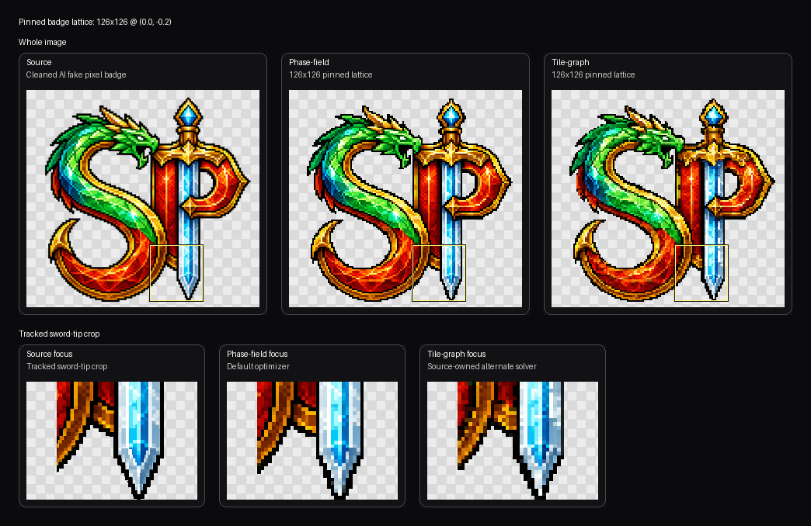

# Repixelizer

Repixelizer is a standalone Python CLI for images that are doing a pixel art impression instead of actually respecting the grid.

It is aimed at the annoying middle ground: sprites, emblems, and logos that look locally pixelated but fall apart the second you ask them to commit to one lattice like grown-ups.

Instead of pretending this is a resize problem, Repixelizer treats it as lattice inference plus local structure preservation: infer the implied grid, choose real output cells, and snap them back onto a coherent pixel lattice while preserving the source's local adjacency patterns.

## Examples

Repixelizer was built to rescue fake pixel art, but it can also be used to generate pixel art directly from non-pixel source art when the shapes are clean and the local structure is doing something useful.

Rows show the source art, a plain Lanczos downscale to the same target size, and the repixelized result. The bottom row also carries a sword-guard picture-in-picture, because that tiny region is one of the more honest tests of whether the tool is preserving local cell adjacency instead of just getting the vibes approximately correct.


That is the two-headed pitch in one image: force non-pixel art onto a coherent grid, or take AI pixel art that only respects the grid locally and make it commit.

## Two Engines

There are two lean mean repixelating machines in here now.

- `phase-field` is the default path. It lays down one displacement vector per output cell and nudges that field until the cells settle into quieter source paint without collapsing into each other. It is the best-looking solver in the repo right now, especially on internal linework and overall structure.
- `tile-graph` is the source-owned alternate path. It extracts candidate tiles from source regions and solves a local adjacency problem instead of optimizing one displacement field. It is slower, moodier, and useful precisely because it fails differently.

Here is the pinned badge comparison on the same lattice, so the machines have to fight fair instead of hiding behind different size guesses:



## Current Status

This repo is past the "pile of hopeful heuristics" stage and into "real machine, still experimental."

What exists now:

- lattice inference with CUDA support
- a lean displacement-field optimizer in `src/repixelizer/phase_field.py`
- a source-owned alternate solver in `src/repixelizer/tile_graph.py`
- automatic diagnostics, comparisons, and benchmark runs
- a tuning harness for offline parameter sweeps
- metrics that finally care about visible structure instead of only pleasing the lattice accountant

What changed recently:

- the old tray-based optimizer is gone
- `phase-field` is now the default optimizer path
- `source_structure` is reported alongside `source_fidelity`, because the old metric was happily calling better-looking images worse
- the tracked sword-tip blemish on the AI badge has its own focused fixture in `tests/fixtures/real/ai-badge-tip-focus.json`

Current read on the engines:

- `phase-field` is the release path. It currently produces the best-looking badge result in the repo, especially on internal linework, even though it still widens the tracked sword-tip stroke a bit too much.
- `tile-graph` is still valuable as the alternate machine. It keeps hard source ownership and often preserves cell identity in a different, sometimes more stubborn way, but it is slower and more temperamental on badge-scale inputs.

Current weak spots:

- `phase-field` still needs better along-stroke versus across-stroke behavior near tapered contours
- tile-graph cold-build time is still dominated by connected-component labeling / region extraction on large fixtures
- lattice selection is still low-confidence on some ugly generated inputs, so pinned-size iteration remains an important workflow for both engines

## Quickstart

```powershell
python -m venv .venv
.venv\Scripts\python -m pip install -e .[dev]
```

Run the optimizer:

```powershell
repixelize input.png --out output.png
repixelize input.png --out output.png --diagnostics-dir diagnostics --device auto
repixelize input.png --out output.png --reconstruction-mode phase-field --diagnostics-dir diagnostics --device auto
repixelize input.png --out output.png --reconstruction-mode tile-graph --diagnostics-dir diagnostics --device cpu
repixelize input.png --out output.png --reconstruction-mode tile-graph --diagnostics-dir diagnostics --device cuda
repixelize input.png --out output.png --reconstruction-mode tile-graph --target-width 126 --target-height 126 --phase-x 0.0 --phase-y -0.2 --device cuda
```

Run the optimizer plus baselines:

```powershell
repixelize compare input.png --out output.png --diagnostics-dir diagnostics
```

## Corpus And Benchmarks

Prepare a local Creative Commons corpus:

```powershell
repixelize prepare-corpus --corpus-dir examples/corpus
```

Run the round-trip benchmark:

```powershell
repixelize benchmark --corpus-dir examples/corpus --out-dir artifacts/benchmark
```

Useful benchmark flags:

- `--profile soft` or `--profile crisp`
- `--case <name>` repeated for a focused slice
- `--limit <n>` for the first `n` matching cases
- `--infer-size` to test automatic size inference
- `--keep-existing` if you explicitly want to preserve an old output directory

By default the benchmark clears its output directory before each run so the artifacts folder stays readable.

## Tuning

Repixelizer includes a black-box tuning loop for longer offline searches over solver weights:

```powershell
repixelize tune --corpus-dir examples/corpus --out-dir artifacts/tuning --profile soft --limit 8
```

This is intentionally a search-based tuner, not gradient descent. The objective depends on discrete argmins, thresholding, and benchmark comparisons, so it is better treated as a repeatable black-box optimization problem.

## Repository Hygiene

This repo is set up to be safe for local experimentation:

- generated outputs under `artifacts/` are ignored
- local corpus payloads under `examples/corpus/originals/` are ignored
- archived raw sprite sheets under `examples/corpus/source-sheets/` are ignored
- generated corpus metadata files are ignored

That keeps benchmark assets, attribution exports, and tuning runs from polluting upstream history while still keeping the code, docs, and corpus layout tracked.

## Repo Layout

- `src/repixelizer`: core package
- `tests`: focused regression tests
- `docs/spec.md`: product and technical spec
- `docs/implementation-plan.md`: working roadmap
- `docs/tile-graph-algorithm-map.md`: detailed tile-graph dataflow and failure-point map
- `docs/lean-optimizer-algorithm-map.md`: map of the live displacement-field optimizer
- `examples/corpus/README.md`: local corpus layout and attribution workflow

Core modules:

- `inference.py`: target size and phase inference
- `phase_field.py`: default displacement-field optimizer
- `tile_graph.py`: source-owned alternate reconstruction path
- `metrics.py`: fidelity, adjacency, and motif metrics
- `benchmark.py`: corpus benchmark runner
- `tuning.py`: black-box hyperparameter search harness
- `synthetic.py`: facsimile generation for tests and benchmarks

## Validation

Run the focused test suite with:

```powershell
.venv\Scripts\python -m pytest -q
```

## Regenerating README Assets

The README images are generated from repo-tracked fixtures, not from random artifacts left lying around:

```powershell
.venv\Scripts\python scripts\generate_readme_previews.py --vector-input tests\fixtures\real\ai-badge-vector.png --ai-input tests\fixtures\real\ai-badge-cleaned.png --out-sheet docs\readme-assets\badge-example-sheet.png --out-guard-crop docs\readme-assets\guard-right-crop-comparison.png --out-engine-sheet docs\readme-assets\engine-comparison-sheet.png --scratch-dir artifacts\readme-build --device auto
```

That regenerates the main README sheet, the standalone sword-guard closeup strip, the pinned phase-field-vs-tile-graph comparison sheet, and scratch outputs under `artifacts/readme-build/` so you can inspect the actual low-res results used to build the docs sample.

## Diagnostic Closeups

For docs or regression notes, you can generate reproducible source/output closeups from output-grid cell coordinates with:

```powershell
.venv\Scripts\python scripts\render_focus_crop.py --input tests\fixtures\real\ai-badge-cleaned.png --out docs\readme-assets\guard-right-crop-source-final.png --cell-bbox 73 20 107 44 --panels source,final --scale 16 --steps 48 --device cpu
```

If you want the full internal state sheet instead of the docs-facing comparison:

```powershell
.venv\Scripts\python scripts\render_focus_crop.py --input tests\fixtures\real\ai-badge-cleaned.png --out docs\readme-assets\guard-right-crop-states.png --cell-bbox 73 20 107 44 --panels source,initial,final --scale 16 --steps 48 --device cpu
```

Notes:
- `--cell-bbox` is in output-grid coordinates, not source-image pixels.
- The script maps that region back to the matching source crop automatically.
- `--device cpu` is the polite choice for docs generation if you do not want to stress the GPU for a tiny crop.

## Notes

- The local corpus is optional; the codebase is still usable without it.
- The benchmark and tuning commands are designed for iterative local work, not for shipping generated artifacts in git.
- Palette enforcement is optional and can be left off for unconstrained recovery runs.
