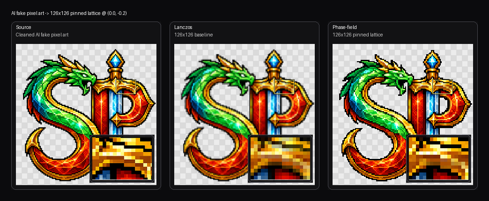

# Repixelizer

Repixelizer is a standalone Python CLI for images that are doing a pixel art impression instead of actually respecting the grid.

It is aimed at the annoying middle ground: sprites, emblems, and logos that look locally pixelated but fall apart the second you ask them to commit to one lattice like grown-ups.

Instead of pretending this is a resize problem, Repixelizer treats it as lattice inference plus local structure preservation: infer the implied grid, choose real output cells, and snap them back onto a coherent pixel lattice while preserving the source's local adjacency patterns.

## Examples

Repixelizer was built to rescue fake pixel art, but it can also be used to generate pixel art directly from non-pixel source art when the shapes are clean and the local structure is doing something useful.

Rows show the source art, a plain Lanczos downscale to the same target size, and the repixelized result. The bottom row also carries a sword-guard picture-in-picture, because that tiny region is one of the more honest tests of whether the tool is preserving local cell adjacency instead of just getting the vibes approximately correct.



That is the two-headed pitch in one image: force non-pixel art onto a coherent grid, or take AI pixel art that only respects the grid locally and make it commit.

## Current Status

This is already a serious experimental baseline, not a toy prototype:

- CUDA-backed inference and solver paths are wired up
- a shared source-lattice reference now drives solver, metrics, and reranking
- round-trip corpus benchmarking is built in
- soft and crisp corruption profiles are supported
- diagnostics and baseline comparisons are written automatically, including per-stage source-fidelity in `run.json`
- a black-box tuning harness exists for longer offline parameter sweeps

The current pipeline is especially strong on benchmarked sprite and emblem inputs where local fake-pixel texture is meaningful but the global grid is inconsistent.

Recent adjacency-focused status:

- the cleaned AI badge regression now beats naive resize on the repo's source-lattice consistency metric under the selected lattice
- the snap-to-refine handoff is now source-first rather than dominated by the softened representative lattice
- low-confidence phase reranking now uses a soft size penalty instead of a hard size-jump reject
- an experimental `tile-graph` reconstruction mode now exists behind `--reconstruction-mode tile-graph`

Current tile-graph status:

- it now keeps candidates strictly local to each output coord and only uses literal source-pixel colors, so it no longer invents averaged patch colors or borrow labels from distant regions
- tile-graph prep is now an edge-only path with no cluster analysis, no hybrid geometry sidecar, and no tile-graph-specific source-reference portrait
- extraction now runs at full source resolution; the old `source_region_stride` subsampling path is gone
- candidate selection is now source-owned: extracted tiles are ranked by their own area, coverage, and edge signal instead of by resemblance to `sharp_rgba` / `edge_rgba`
- occupied foreground cells no longer get papered over with injected `sharp_pixel` or `edge_pixel` fallbacks; if extraction cannot produce a real tile there, the build fails instead of lying
- the adjacency term is now learned from extracted tiles themselves, not from sampled one-cell-away RGBA deltas
- tile extraction no longer walks components with seed queues and one-cell windows; it now directly reduces `(component_id, output_cell)` overlaps into candidate shards
- the deep-dive map in `docs/tile-graph-algorithm-map.md` now reflects the living machine directly instead of documenting the dead portrait/stride/delta path
- the extraction stage still has an explicit empty-cell overlap fill pass, so output cells that actually contain opaque source pixels do not silently lose their extracted region bucket
- the latest full-emblem probe under `artifacts/full-emblem-tile-graph-atomic-v3-cuda/` lands at `0.0224` source-fidelity, beating the earlier full-CUDA tile-graph baseline at `0.0283`
- tile-graph now falls back to its initial assignment when the propagation loop would make source-lattice fidelity worse, which is currently important for preserving sharp internal contour cells
- it still beats naive resize on the repo's synthetic thin-feature regression and now does so without letting the final propagation step blur past the initial placement
- source-region connected-components now have a device-side Torch path, so the expensive labeling step no longer depends on Python flood fill
- profiling the older selected badge candidate showed the main bottleneck was model construction rather than the solver loop: `build_tile_graph_model(...)` took about `142.3s`, and about `131.2s` of that was `_extract_source_region_tiles(...)`
- after the first pruning pass, tile-graph no longer spends iteration time on pipeline rerank probes at all; it now runs the chosen or pinned lattice directly
- tile-graph now also skips cluster analysis entirely and no longer uses sharp/edge portrait anchors in unary scoring; the path keeps only edge scouting plus direct per-cell source summaries
- after the reduce-by-key rewrite, the large-fixture bottleneck moved: extraction is much cheaper, and the main cold-build cost is now connected-component labeling / label compression rather than per-component window cutting
- the pipeline now has a direct-control path for iteration: `--target-width` / `--target-height` plus optional `--phase-x` / `--phase-y` let you run an exact lattice without paying the full lattice search, and `--skip-phase-rerank` lets you keep the pipeline from second-guessing that choice
- repeated fixed-lattice `tile-graph` runs in the same Python process now reuse the expensive model build; on the cleaned badge at pinned `126x126` / phase `(0.0, -0.2)`, the first CUDA run took about `10.2s` and the second cached rerun took about `2.1s`
- the latest reduce-by-key pinned badge probe under `artifacts/tile-graph-reducebykey-v1-badge-126/` finishes in about `16.1s` cold and `6.0s` warm on CUDA, versus the previous full-resolution cut at about `96.9s` cold and `5.4s` warm
- that speed pass is a real throughput win but a small quality regression: the same pinned badge case moves from `0.1814` to `0.2036` source-fidelity
- the optimizer now has its own deep-dive map in `docs/optimizer-algorithm-map.md`, and the first cut from that map removed the old UV-optimizer name plus the continuous k-means cluster-boundary scout; the continuous path is now a fixed-lattice, source-first discrete chooser guided by real edge evidence
- optimizer preparation is now split into a private `_OptimizerPrep` bundle, so the continuous path has a visible seam between "build the map" and "choose the pixels"
- refine is now source-first too: the representative portrait still stabilizes snap, but refine and final structure choice no longer consult it, and the pinned badge smoke improved slightly from `0.07535` to `0.07485`
- the next relax cut also paid off: removing the old relax-mode bonus while keeping the core relax stage improved the same pinned badge smoke again from `0.07485` to `0.07451`
- the optimizer now emits stage displacement diagnostics too, so `run.json` can show what snap, relax handoff, relax mode, and final refine actually did to the per-cell source-pixel displacement field instead of just reporting a single fidelity score
- those new diagnostics also settled the design argument about relax: on the pinned badge check under `artifacts/optimizer-relax-purpose-check/`, relax improves source-fidelity a bit (`0.07549` without relax to `0.07451` with it), but it does not act like a strong broad-swatch phase smoother; the displacement field stays roughly as jittery, so the current relax stage is better described as a soft consensus / handoff stabilizer over fixed local candidates
- after the first pruning pass, tile-graph no longer participates in pipeline phase-rerank probes and no longer carries hybrid geometry priors through its unary cost; the path is now one lattice-conditioned candidate generator plus one local discrete solver
- this fixes the core design mismatch that had allowed repeated distant labels to create big same-color patches and opaque black background blocks
- on the current `24x24` emblem smoke case, an end-to-end `tile-graph` run dropped from about `2.57s` on CPU to `0.61s` on CUDA on this machine
- the older hard-edge-only candidate widening pass under `artifacts/full-emblem-tile-graph-hard-edge-v2-cuda/` remains a useful negative result: more edge choices alone sharpen some cells locally but still regress full-emblem source-fidelity (`0.0377`)

## Quickstart

```powershell
python -m venv .venv
.venv\Scripts\python -m pip install -e .[dev]
```

Run the optimizer:

```powershell
repixelize input.png --out output.png
repixelize input.png --out output.png --diagnostics-dir diagnostics --device auto
repixelize input.png --out output.png --reconstruction-mode tile-graph --diagnostics-dir diagnostics --device cpu
repixelize input.png --out output.png --reconstruction-mode tile-graph --diagnostics-dir diagnostics --device cuda
repixelize input.png --out output.png --reconstruction-mode tile-graph --target-width 126 --target-height 126 --phase-x 0.0 --phase-y -0.2 --device cuda
```

Run the optimizer plus baselines:

```powershell
repixelize compare input.png --out output.png --diagnostics-dir diagnostics
```

## Corpus And Benchmarks

Prepare a local Creative Commons corpus:

```powershell
repixelize prepare-corpus --corpus-dir examples/corpus
```

Run the round-trip benchmark:

```powershell
repixelize benchmark --corpus-dir examples/corpus --out-dir artifacts/benchmark
```

Useful benchmark flags:

- `--profile soft` or `--profile crisp`
- `--case <name>` repeated for a focused slice
- `--limit <n>` for the first `n` matching cases
- `--infer-size` to test automatic size inference
- `--keep-existing` if you explicitly want to preserve an old output directory

By default the benchmark clears its output directory before each run so the artifacts folder stays readable.

## Tuning

Repixelizer includes a black-box tuning loop for longer offline searches over solver weights:

```powershell
repixelize tune --corpus-dir examples/corpus --out-dir artifacts/tuning --profile soft --limit 8
```

This is intentionally a search-based tuner, not gradient descent. The objective depends on discrete argmins, thresholding, and benchmark comparisons, so it is better treated as a repeatable black-box optimization problem.

## Repository Hygiene

This repo is set up to be safe for local experimentation:

- generated outputs under `artifacts/` are ignored
- local corpus payloads under `examples/corpus/originals/` are ignored
- archived raw sprite sheets under `examples/corpus/source-sheets/` are ignored
- generated corpus metadata files are ignored

That keeps benchmark assets, attribution exports, and tuning runs from polluting upstream history while still keeping the code, docs, and corpus layout tracked.

## Repo Layout

- `src/repixelizer`: core package
- `tests`: focused regression tests
- `docs/spec.md`: product and technical spec
- `docs/implementation-plan.md`: working roadmap
- `docs/tile-graph-algorithm-map.md`: detailed tile-graph dataflow and failure-point map
- `docs/optimizer-algorithm-map.md`: detailed optimizer dataflow and contradiction map
- `examples/corpus/README.md`: local corpus layout and attribution workflow

Core modules:

- `inference.py`: target size and phase inference
- `continuous.py`: source-aware lattice snapping and local discrete refinement
- `metrics.py`: fidelity, adjacency, and motif metrics
- `benchmark.py`: corpus benchmark runner
- `tuning.py`: black-box hyperparameter search harness
- `synthetic.py`: facsimile generation for tests and benchmarks

## Validation

Run the focused test suite with:

```powershell
.venv\Scripts\python -m pytest -q
```

## Regenerating README Assets

The README comparison sheet is generated from repo-tracked fixtures, not from random artifacts left lying around:

```powershell
.venv\Scripts\python scripts\generate_readme_previews.py --vector-input tests\fixtures\real\ai-badge-vector.png --ai-input tests\fixtures\real\ai-badge-cleaned.png --out-sheet docs\readme-assets\badge-example-sheet.png --out-guard-crop docs\readme-assets\guard-right-crop-comparison.png --scratch-dir artifacts\readme-build --device cpu
```

That regenerates the README sheet, the standalone sword-guard closeup strip, and scratch outputs under `artifacts/readme-build/` so you can inspect the actual low-res results used to build the docs sample.

## Diagnostic Closeups

For docs or regression notes, you can generate reproducible source/output closeups from output-grid cell coordinates with:

```powershell
.venv\Scripts\python scripts\render_focus_crop.py --input tests\fixtures\real\ai-badge-cleaned.png --out docs\readme-assets\guard-right-crop-source-final.png --cell-bbox 73 20 107 44 --panels source,final --scale 16 --steps 48 --device cpu
```

If you want the full internal state sheet instead of the docs-facing comparison:

```powershell
.venv\Scripts\python scripts\render_focus_crop.py --input tests\fixtures\real\ai-badge-cleaned.png --out docs\readme-assets\guard-right-crop-states.png --cell-bbox 73 20 107 44 --panels source,snap,relaxed,final --scale 16 --steps 48 --device cpu
```

Notes:
- `--cell-bbox` is in output-grid coordinates, not source-image pixels.
- The script maps that region back to the matching source crop automatically.
- `--device cpu` is the polite choice for docs generation if you do not want to stress the GPU for a tiny crop.

## Notes

- The local corpus is optional; the codebase is still usable without it.
- The benchmark and tuning commands are designed for iterative local work, not for shipping generated artifacts in git.
- Palette enforcement is optional and can be left off for unconstrained recovery runs.
