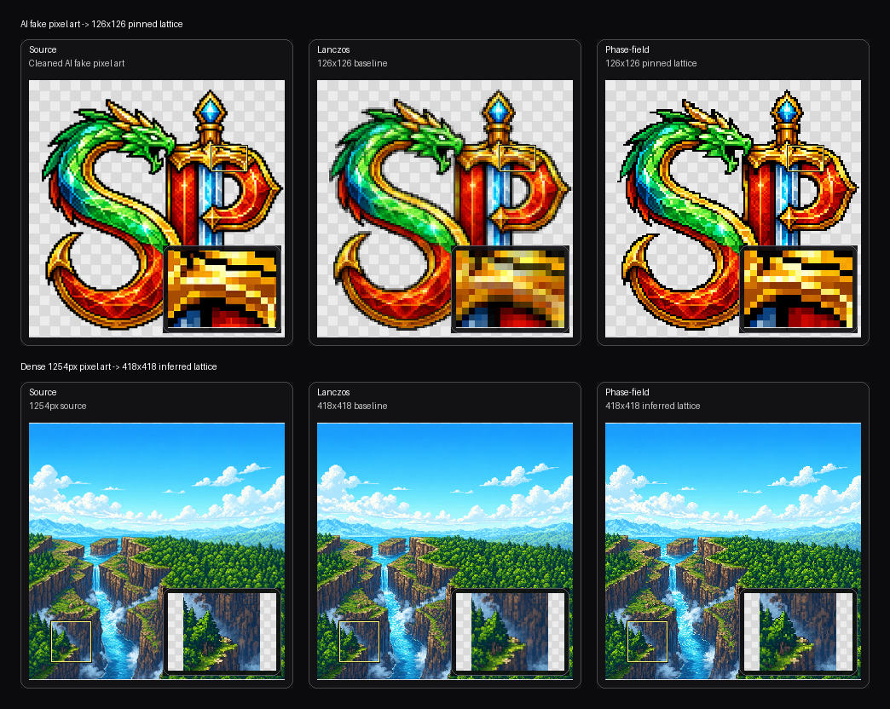

# Repixelizer

Repixelizer is a Python tool for images that are doing a pixel art impression instead of actually respecting the grid.

It is aimed at the annoying middle ground: sprites, emblems, and logos that
look locally pixelated but fall apart the second you ask them to commit to one
lattice like grown-ups.

Repixelizer treats fake pixel art as lattice inference plus `phase-field`
reconstruction: infer the ruler, preview the edges, let every output cell
search a tiny local window for quieter paint, relax the whole sheet back into a
coherent lattice, then sample once and go home.

## GUI First

The web GUI is the main way to use this thing unless you enjoy raw flags for sport.

It gives you:

- drag-and-drop input
- live phase-field feedback while autocorr inference, rerank, and solving run
- synchronized input/output inspection zoom for close comparison
- a built-in output editor for single-pixel cleanup with eyedropper and pencil tools

Run it from the repo checkout:

```powershell
.\scripts\run_gui.ps1
```

If you want to bypass the PowerShell wrapper and call Python directly:

```powershell
.\.venv\Scripts\python scripts\run_gui.py
```

If you want to support the official hosted deployment and help us scale the poor little server when people start leaning on it, join the [GameCult Patreon](https://www.patreon.com/GameCult). At `$10` per subscriber, the math gets a lot less tragic.

## Example

This sheet carries two cases: the ugly fake-pixel badge and a dense
higher-resolution landscape. The badge row shows the core salvage story. The
landscape row shows how the same automatic path handles a much larger source.

Each row carries its own inset, so the tiny details have nowhere to hide.



## How It Works

Repixelizer does one thing:

`source image -> lattice inference -> diagnostic edge preview -> fixed lattice centers ->
hierarchical flatness signal -> explicit local search + lattice relaxation ->
nearest source sample -> cleanup / diagnostics`

In plainer language:

1. infer the target lattice size
2. build one diagnostic edge preview over the source
3. nail down fixed lattice centers
4. run the `phase-field` solve by letting each cell search a tiny local window,
   move toward the flattest nearby source position, and relax back into a
   coherent lattice
5. sample the source once from the final cell positions
6. clean up the discrete result, optionally fit a palette, and write
   diagnostics

That is the machine described in `docs/lean-optimizer-algorithm-map.md`.
Comparison mode just runs that same `phase-field` result next to the baselines.

## Current Status

This repo is past the "pile of hopeful heuristics" stage and into "real
machine, still experimental."

What exists now:

- a web GUI with drag-and-drop, live diagnostics, comparison tools, and pixel cleanup
- lattice inference with CUDA support
- the `phase-field` reconstruction engine in `src/repixelizer/phase_field.py`
- automatic diagnostics, comparisons, and benchmark runs
- spritesheet CLI mode that detects separated regions, chooses one shared texel density for the sheet, and repixelizes each region independently
- a tuning harness for offline parameter sweeps
- `source_fidelity` and `source_structure` metrics for lattice agreement and visible structure
- a shippable explicit local-search solver config, with tuning notes in `docs/solver-tuning-lessons-2026-04-29.md`

Current weak spots:

- `phase-field` is usable, not final; signal knobs still need a disciplined follow-up pass around the current motion basin
- lattice selection is still low-confidence on some ugly generated inputs, so visual inspection and pinned-size iteration remain important workflows

## Quickstart

```powershell
python -m venv .venv
.venv\Scripts\python -m pip install -e .[dev]
```

Launch the GUI:

```powershell
.\scripts\run_gui.ps1
```

Run the optimizer from the CLI:

```powershell
repixelize input.png --out output.png
repixelize input.png --out output.png --diagnostics-dir diagnostics --device auto
repixelize input.png --out output.png --target-width 126 --target-height 126 --device cuda
```

Run the optimizer plus baselines:

```powershell
repixelize compare input.png --out output.png --diagnostics-dir diagnostics
```

Run a spritesheet as separate sprite regions:

```powershell
repixelize spritesheet sheet.png --out output.png --sprite-count 6 --target-width 32 --target-height 32
repixelize spritesheet sheet.png --out output.png --diagnostics-dir diagnostics
```

When `--sprite-count` is omitted, Repixelizer detects large separated foreground
regions. By default, automatic spritesheet mode infers each crop once, chooses a
robust shared texel density for the sheet, and pins each crop to that density
before reconstruction. Pinned target dimensions apply per sprite, not to the
whole sheet. Add `--strip-background` when the sheet has an opaque
edge-connected backdrop that should become transparent before cropping.

## Corpus And Benchmarks

Prepare a local Creative Commons corpus:

```powershell
repixelize prepare-corpus --corpus-dir examples/corpus
```

Run the round-trip benchmark:

```powershell
repixelize benchmark --corpus-dir examples/corpus --out-dir artifacts/benchmark
```

Useful benchmark flags:

- `--profile soft` or `--profile crisp`
- `--case <name>` repeated for a focused slice
- `--limit <n>` for the first `n` matching cases
- `--infer-size` to test automatic size inference
- `--keep-existing` if you explicitly want to preserve an old output directory

By default the benchmark clears its output directory before each run so the artifacts folder stays readable.

## Tuning

Repixelizer includes a black-box tuning loop for longer offline searches over solver weights:

```powershell
repixelize tune --corpus-dir examples/corpus --out-dir artifacts/tuning --profile soft --limit 8
```

This is intentionally a search-based tuner, not gradient descent. The objective depends on discrete argmins, thresholding, and benchmark comparisons, so it is better treated as a repeatable black-box optimization problem.

## Repository Hygiene

This repo is set up to be safe for local experimentation:

- generated outputs under `artifacts/` are ignored
- local corpus payloads under `examples/corpus/originals/` are ignored
- archived raw sprite sheets under `examples/corpus/source-sheets/` are ignored
- generated corpus metadata files are ignored

That keeps benchmark assets, attribution exports, and tuning runs from polluting upstream history while still keeping the code, docs, and corpus layout tracked.

## Repo Layout

- `src/repixelizer`: core package
- `tests`: focused regression tests
- `docs/spec.md`: product and technical spec
- `docs/implementation-plan.md`: working roadmap
- `docs/lean-optimizer-algorithm-map.md`: map of the live phase-field solver
- `examples/corpus/README.md`: local corpus layout and attribution workflow

Core modules:

- `inference.py`: target size inference
- `spritesheet.py`: spritesheet region detection, shared-density sizing, and per-region pipeline orchestration
- `phase_field.py`: explicit local-search phase-field solver
- `metrics.py`: fidelity, adjacency, and motif metrics
- `benchmark.py`: corpus benchmark runner
- `tuning.py`: black-box hyperparameter search harness
- `synthetic.py`: facsimile generation for tests and benchmarks

## Validation

Run the focused test suite with:

```powershell
.venv\Scripts\python -m pytest -q
```

## Regenerating README Assets

The README images are generated from repo-tracked fixtures, not from random
artifacts left lying around:

```powershell
.venv\Scripts\python scripts\generate_readme_previews.py --out-sheet docs\readme-assets\badge-example-sheet.png --out-guard-crop docs\readme-assets\guard-right-crop-comparison.png --scratch-dir artifacts\readme-build --device auto
```

That regenerates the main README sheet, the standalone sword-guard closeup
strip, and scratch outputs under `artifacts/readme-build/` so you can inspect
the actual low-res results used to build the docs sample.

## Diagnostic Closeups

For docs or regression notes, you can generate reproducible source/output closeups from output-grid cell coordinates with:

```powershell
.venv\Scripts\python scripts\render_focus_crop.py --input tests\fixtures\real\ai-badge-cleaned.png --out docs\readme-assets\guard-right-crop-source-final.png --cell-bbox 73 20 107 44 --panels source,final --scale 16 --steps 48 --device cpu
```

If you want the full internal state sheet instead of the docs-facing comparison:

```powershell
.venv\Scripts\python scripts\render_focus_crop.py --input tests\fixtures\real\ai-badge-cleaned.png --out docs\readme-assets\guard-right-crop-states.png --cell-bbox 73 20 107 44 --panels source,initial,final --scale 16 --steps 48 --device cpu
```

Notes:
- `--cell-bbox` is in output-grid coordinates, not source-image pixels.
- The script maps that region back to the matching source crop automatically.
- `--device cpu` is the polite choice for docs generation if you do not want to stress the GPU for a tiny crop.

## Notes

- The local corpus is optional; the codebase is still usable without it.
- The benchmark and tuning commands are designed for iterative local work, not for shipping generated artifacts in git.
- Palette enforcement is optional and can be left off for unconstrained recovery runs.
