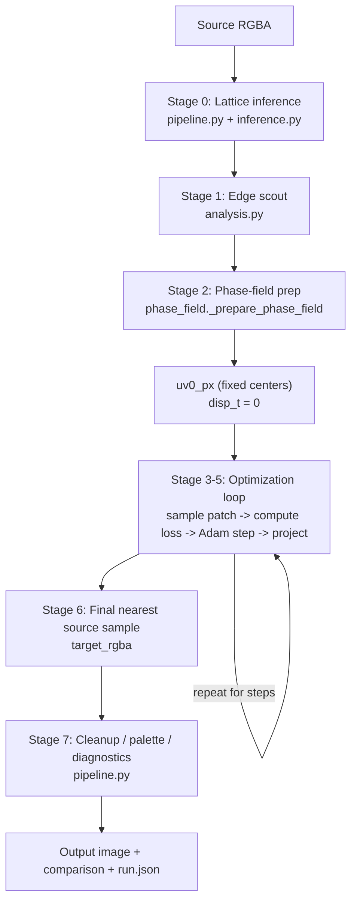

# Phase-Field Algorithm Map

## What this file is

This is a map of the live `phase-field` machine in the repo right now.

Not the dream version. Not the sales pitch. Not the older tray cult we dragged out behind the shed and shot. The actual machine:

`source image -> lattice inference -> edge scout -> fixed lattice centers -> projected displacement-field optimization -> nearest source sample -> cleanup / diagnostics`

The relevant source lives in:

- `src/repixelizer/pipeline.py`
- `src/repixelizer/inference.py`
- `src/repixelizer/analysis.py`
- `src/repixelizer/phase_field.py`
- `src/repixelizer/discrete.py`
- `src/repixelizer/diagnostics.py`
- `src/repixelizer/metrics.py`

## One-sentence machine

The solver nails a regular grid over the source, gives every output cell a tiny `(dx, dy)` shove vector, nudges those shoves until the cells settle into quieter paint while staying in order, then samples the source once and goes home.

## Core state

These are the pieces that actually matter:

- `inference`: chosen lattice width, height, phase, confidence, and optional top candidates
- `edge_map`: one normalized scout map of where the source image has strong luminance/alpha changes
- `uv0_px`: the fixed source-space center for each output cell before any optimization
- `disp_t`: the live displacement field, one `(dx, dy)` vector per output cell
- `pos_px = uv0_px + disp_t`: the current sample positions in source pixel space
- `target_rgba`: the final output grid after nearest-source sampling

Everything else is either support scaffolding or receipts.

## Diagram

## How to read this machine

The machine has one honest variable: the displacement field.

- `uv0_px` is fixed after inference
- `disp_t` is optimized
- the final image comes from rounding `uv0_px + disp_t` to real source pixels

That means the solver is not choosing from trays, not blending portraits, and not negotiating among rival subsolvers. It is one field moving under one loss, with projection after each step to stop it from folding into paste.

## Stage 0: The pipeline chooses the ruler

### Source

- `run_pipeline(...)` in `src/repixelizer/pipeline.py`
- `_resolve_requested_target_dims(...)` in `src/repixelizer/pipeline.py`
- `infer_lattice(...)` and `infer_fixed_lattice(...)` in `src/repixelizer/inference.py`
- `_select_phase_candidate_with_reconstruction(...)` in `src/repixelizer/pipeline.py`

### Inputs

- source RGBA image
- optional pinned target size / width / height / phase
- optional `--skip-phase-rerank`

### Outputs

- `InferenceResult`
  - `target_width`
  - `target_height`
  - `phase_x`
  - `phase_y`
  - `confidence`
  - `top_candidates`

### What the source actually does

The pipeline first decides whether the lattice is:

- fixed explicitly by the caller, using `infer_fixed_lattice(...)`, or
- searched automatically by `infer_lattice(...)`

`infer_lattice(...)` itself is already a small machine:

- it estimates rough cell spacing from source change intervals and autocorrelation
- it builds candidate output sizes
- it scores a small phase grid for each size
- it keeps the best candidate plus top alternates

After that, phase rerank may still happen, but only for `phase-field`, only when confidence is low, and only when rerank is enabled. The rerank probe is not a full solve. It calls `_run_reconstruction(...)` with `steps=0`, which means it evaluates the lattice using the zero-displacement field before any optimization movement.

That part matters. The pipeline is effectively asking:

`before the field starts wiggling, which lattice already looks least stupid?`

### Metaphor

This is the survey crew laying down the ruler and arguing about where the graph paper should go.

If the user pinned the lattice, the argument is over. If not, the crew drags the ruler around, squints at a bunch of possible alignments, and picks the one that seems least embarrassing before the real workers show up.

## Stage 1: The edge scout builds a danger map

### Source

- `analyze_phase_field_source(...)` in `src/repixelizer/analysis.py`
- `_compute_edge_map(...)` and `_compute_edge_map_torch(...)` in `src/repixelizer/analysis.py`

### Inputs

- source RGBA image
- optional torch device

### Outputs

- `PhaseFieldSourceAnalysis(edge_map=...)`

### What the source actually does

The analysis stage computes a single normalized `edge_map`:

- luminance is derived from RGB
- alpha is kept as a separate structure cue
- horizontal and vertical absolute differences are measured for both luminance and alpha
- those differences are combined into a magnitude map
- the map is normalized to `[0, 1]`

That is all. No clusters, no portraits, no local exemplars. Just one scout report about where the source is calm and where it is breaking into edges.

The map is used in two places later:

- inside the loss, to penalize landing on edgy regions
- inside the smoothness term, to weaken neighbor springs across real edges

### Metaphor

This stage walks the mural with a bucket of chalk and circles every crack, seam, and paint jump.

It does not tell the solver what color to choose. It tells the solver where the floorboards are creaking.

## Stage 2: Prep converts the source into field-ready cargo

### Source

- `_prepare_phase_field(...)` in `src/repixelizer/phase_field.py`
- `_make_regular_uv_px(...)` in `src/repixelizer/phase_field.py`
- `premultiply(...)` in `src/repixelizer/io.py`

### Inputs

- source RGBA
- chosen `InferenceResult`
- `PhaseFieldSourceAnalysis`
- `SolverHyperParams`
- torch device

### Outputs

- `_PhaseFieldPrep`
  - `source_t`
  - `edge_t`
  - `uv0_px_t`
  - `uv0_norm`
  - `base_x_t`
  - `base_y_t`
  - `guidance`
  - `cell_x`, `cell_y`
  - `patch_offsets_t`
  - `width`, `height`

### What the source actually does

Prep does a few brutally practical things:

1. Premultiplies the source RGBA.
   - This makes later color differences respect alpha instead of hallucinating invisible color as if it mattered equally.

2. Builds the fixed lattice centers with `_make_regular_uv_px(...)`.
   - `cell_x = source_width / target_width`
   - `cell_y = source_height / target_height`
   - `phase_x` and `phase_y` shift those centers before clipping to image bounds

3. Converts the source, edge map, and lattice centers to torch tensors.

4. Builds a tiny 9-point patch stencil from `phase_field_patch_extent`.
   - center
   - left / right / up / down
   - four diagonals

5. Downscales the edge map to output resolution and stores it as `guidance`.
   - This is not part of the optimizer proper.
   - It is later passed into `cleanup_pixels(...)` so postprocessing can avoid sanding down high-edge regions.

### Metaphor

This is the loading dock.

The source gets wrapped so transparent paint stops lying about its weight. The ruler gets converted into a neat grid of scaffold anchors. Then the solver gets handed a tiny feeler gauge: one center probe and eight little taps around it so it can ask, "am I standing in a quiet patch, or on the lip of a mess?"

## Stage 3: The field starts at stillness

### Source

- `optimize_phase_field(...)` in `src/repixelizer/phase_field.py`
- `_nearest_source_rgba(...)` in `src/repixelizer/phase_field.py`

### Inputs

- `_PhaseFieldPrep`
- `SolverHyperParams`
- `steps`
- `seed`

### Outputs

- `disp_t` initialized to zero
- `initial_rgba`

### What the source actually does

The solver initializes:

- `disp_t = 0` everywhere
- Adam optimizer over that tensor

Then it immediately computes a baseline image by rounding the fixed lattice centers to nearest integer source pixels:

- `initial_x = round(uv0_px[..., 0])`
- `initial_y = round(uv0_px[..., 1])`
- `initial_rgba = source[initial_y, initial_x]`

This is the zero-displacement output. Diagnostics still call this `snap_initial`, which is a fossil from the old optimizer. There is no snap stage anymore. It is just "the field before it moves."

### Metaphor

Every output cell begins with its boots directly under its shoulders.

No clairvoyance. No tray of options. Just a line of workers standing on the scaffold and pointing straight down at the source where the ruler says they ought to start.

## Stage 4: The loss samples the current hypothesis

### Source

- `_phase_field_loss(...)` in `src/repixelizer/phase_field.py`
- `_sample_rgba(...)`
- `_sample_scalar(...)`
- `_sample_patch_rgba(...)`
- `_sample_patch_scalar(...)`

### Inputs

- current `disp_t`
- `_PhaseFieldPrep`
- `SolverHyperParams`

### Outputs

- scalar loss
- sampled RGBA at current positions
- per-term diagnostics

### What the source actually does

The live sample positions are:

- `pos_px = uv0_px_t + disp_t`

The loss then samples two things around those positions:

- premultiplied RGBA from `source_t`
- edge values from `edge_t`

Sampling is bilinear during optimization because the loss needs gradients.

It then computes five terms.

#### 4A. Local coherence

Code:

- `local_coherence = (neighbor_rgba - center_rgba[..., None, :]).abs().mean()`

Meaning:

The center sample is compared against the eight patch samples around it. If the patch is internally quiet, this term stays small. If the center sits on a messy boundary or mixed cell, it rises.

#### 4B. Local edge penalty

Code:

- `local_edge = patch_edge.mean()`

Meaning:

The same 9-point patch is sampled from the edge map. Quiet interior regions score low; sharp edges and alpha jumps score high.

This is the direct shove away from "standing on a line."

#### 4C. Edge-aware smoothness

Code:

- midpoints between neighboring sample positions are computed
- edge strength is sampled at those midpoints
- weights are `exp(-edge_gate_strength * edge_mid)`
- neighbor displacement deltas are measured in normalized cell units

Meaning:

Neighboring cells are tied together by springs, but the springs weaken when the midpoint between them crosses a real edge. So the field prefers drifting together in flat regions and breaking rank at actual structure.

#### 4D. Collapse penalty

Code:

- neighboring sample positions along x and y must stay at least `min_spacing_ratio * cell_size` apart
- violations are squared with `relu(min_step - actual_step)^2`

Meaning:

This is the anti-crumple term. It stops adjacent output cells from collapsing onto the same source pixels or overtaking one another.

#### 4E. Magnitude prior

Code:

- normalized displacement length squared, averaged over the field

Meaning:

The field pays a small tax for wandering too far. Motion has to earn its keep.

### Metaphor

Each worker is standing on a spring-loaded square of graph paper, poking the wall in a 3x3 halo around their boot.

- If the halo feels like one calm slab of paint, good.
- If it feels jagged and noisy, bad.
- If neighboring workers want to drift together across a smooth region, fine.
- If they try to dogpile into the same footprint, the foreman throws a brick at them.

## Stage 5: Adam moves the sheet, then projection slaps it back into order

### Source

- the optimization loop in `optimize_phase_field(...)`
- `_project_displacements_in_place(...)` in `src/repixelizer/phase_field.py`

### Inputs

- current `disp_t`
- gradients from `_phase_field_loss(...)`
- min spacing
- max displacement bounds

### Outputs

- updated, projected `disp_t`
- `loss_history`

### What the source actually does

For each step:

1. Zero optimizer gradients.
2. Compute the loss and its term breakdown.
3. Backpropagate through the bilinear samples.
4. Take an Adam step on `disp_t`.
5. Immediately project the resulting field back into a valid shape.

Projection is not decorative. `_project_displacements_in_place(...)` enforces:

- left-to-right order with minimum x spacing
- top-to-bottom order with minimum y spacing
- displacement clamps of `[-max_dx, max_dx]` and `[-max_dy, max_dy]`
- image-bound clamping on the live sample positions

So the live machine is not "pure unconstrained gradient descent." It is projected Adam on a constrained displacement sheet.

### Metaphor

Adam is the part of the crew that says, "fine, slide a little left, slide a little down."

Projection is the bouncer at the door saying:

- you two still need to stay in order
- nobody gets to leave the mural
- nobody stretches farther than the leash allows

Without that bouncer, the field would absolutely find a way to ooze into a puddle.

## Stage 6: Final sampling throws away the bilinear training wheels

### Source

- final section of `optimize_phase_field(...)`
- `_nearest_source_rgba(...)`

### Inputs

- final `disp_t`
- fixed `uv0_px`
- original source RGBA

### Outputs

- `target_rgba`
- final `uv_field`
- stage diagnostics

### What the source actually does

After the loop:

1. Compute `final_px = uv0_px + disp_t`.
2. Round those positions to integer source pixels.
3. Index the original source RGBA with those integer positions.

That last part matters. The final image is not bilinear soup. Bilinear sampling is only used inside the loss so the field can be optimized. The emitted image is made of actual source pixels.

The solver also packages:

- `uv_field` in normalized coordinates
- `loss_history`
- displacement diagnostics for the initial and final states
- summary phase-field metrics like mean displacement, max displacement, and final loss terms

### Metaphor

During training, the workers are allowed to squint and interpolate.

At the end, that privilege is revoked. They must plant the flag on a real brick in the wall. No anti-aliased dithering apology. Pick a source pixel and live with it.

## Stage 7: The pipeline does the boring adult work

### Source

- `cleanup_pixels(...)` in `src/repixelizer/discrete.py`
- palette handling in `src/repixelizer/pipeline.py` and `src/repixelizer/palette.py`
- diagnostics writing in `src/repixelizer/diagnostics.py`

### Inputs

- `target_rgba`
- `guidance_strength`
- optional palette settings
- diagnostics directory

### Outputs

- final saved output
- optional palette-constrained output
- comparison sheets
- displacement previews
- `run.json`

### What the source actually does

After reconstruction:

1. `cleanup_pixels(...)` is called.
   - Right now the default is `iterations=0`, so cleanup is usually a no-op.
   - If enabled later, it tries tiny local replacements except in high-guidance regions.

2. Optional palette quantization runs.

3. Diagnostics are written:
   - source/output comparison
   - lattice overlay
   - alpha preview
   - displacement previews
   - `run.json` summary

### Metaphor

The main machine is done. This stage is just sweeping the floor, labeling the crates, and taking pictures for the insurance claim.

## Stage 8: The machine judges itself

### Source

- `summarize_run(...)` in `src/repixelizer/diagnostics.py`
- `source_lattice_consistency_breakdown(...)` in `src/repixelizer/metrics.py`
- `source_structure_breakdown(...)` in `src/repixelizer/metrics.py`
- `_displacement_diagnostics(...)` in `src/repixelizer/phase_field.py`

### Inputs

- source image
- initial output
- final output
- final displacement field

### Outputs

- `source_fidelity`
- `source_structure`
- displacement summaries
- coherence summaries

### What the source actually does

The repo keeps two families of score now:

- `source_fidelity`
  - compares the output against a lattice-derived portrait of the source
  - useful, but willing to lie if the portrait itself misses visible structure

- `source_structure`
  - cares about foreground reconstruction, edge placement, wobble, edge support, and exact matches
  - closer to what human eyes were screaming about the whole time

The solver also reports displacement statistics like:

- mean magnitude
- orthogonal jitter
- local residual
- dominant offset ratio

Those are the closest thing this machine has to an X-ray of its phase drift.

### Metaphor

This is the coroner's table.

The machine gets judged two ways:

- by the lattice accountant, who cares whether it matches the inferred ledger
- by the eye doctor, who cares whether the visible linework survived the trip

We learned the hard way that the accountant can be a liar.

## What this machine is good at

- one fixed ruler after inference
- one real optimization variable
- one compact loss
- honest final nearest-source sampling
- explicit order-preserving projection after every step

Those pieces all speak the same language.

## What is still weird

- `snap_initial` is still a legacy label for the zero-displacement baseline
- low-confidence phase rerank judges lattices using a `steps=0` probe, not the full optimized field
- the edge scout only knows edge magnitude, not direction, so the solver still struggles with along-stroke versus across-stroke behavior near tapered contours

Those are not crimes, but they are live seams.

## What does not belong back in here

If any of these try to crawl back into the machine, they should be treated like raccoons in the vents:

- representative portraits
- source-reference portraits driving the optimizer
- candidate trays
- snap / relax / refine subsolver theology
- duplicated motif / line / boundary dialects

The whole point of this machine is that it stays one field, one loss, one final sample.

## The diamond test

Can a new reader describe the entire solver without sounding like they are trying to justify a committee's expense report?

Right now, mostly yes.

That means the machine is finally small enough to improve without losing the plot. The job now is not to decorate it. The job is to make the field better at preserving linework without turning it back into baroque nonsense.
