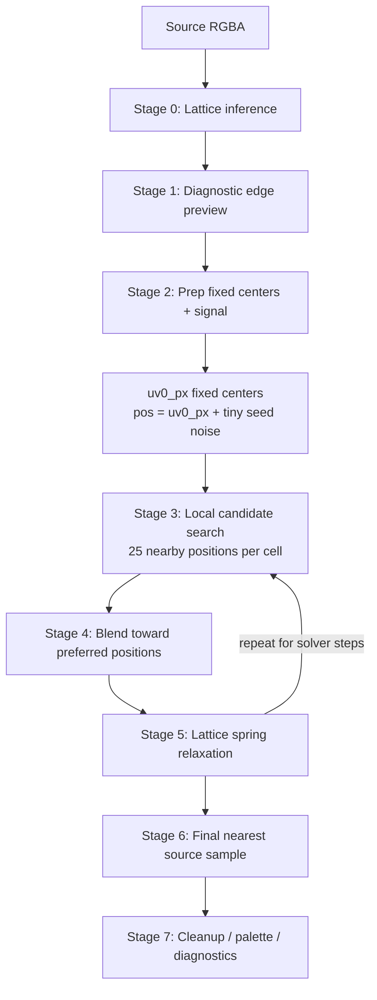

# Phase-Field Algorithm Map

## What this file is

This is the source-grounded map of the live `phase-field` reconstruction machine.

The current spine is:

`source image -> lattice inference -> diagnostic edge preview -> fixed lattice centers -> hierarchical flatness signal -> explicit local search + lattice relaxation -> nearest source sample -> cleanup / diagnostics`

The relevant source lives in:

- `src/repixelizer/pipeline.py`
- `src/repixelizer/inference.py`
- `src/repixelizer/analysis.py`
- `src/repixelizer/phase_field.py`
- `src/repixelizer/discrete.py`
- `src/repixelizer/diagnostics.py`
- `src/repixelizer/metrics.py`

## One-sentence machine

The solver lays a regular grid over the source, lets each cell look in a small local window for the flattest nearby source position, blends toward that local preference, relaxes the lattice back toward coherent spacing, then samples real source pixels once and goes home.

## Core state

These are the pieces that actually matter:

- `InferenceResult`: chosen lattice width, height, confidence, and optional top candidates
- `edge_map`: normalized luminance/alpha diagnostic preview from `analysis.py`
- `uv0_px`: fixed source-space center for each output cell before movement
- `signal_map`: hierarchical flatness map built in `phase_field.py`
- `pos`: live source-space sample positions, initialized from `uv0_px`
- `disp = pos - uv0_px`: reported displacement field derived from live positions
- `target_rgba`: final output grid after nearest-source sampling

The remaining helpers load inputs, write diagnostics, or carry this state across
the CLI, GUI, and comparison harness.

## Diagram


```mermaid
flowchart TD
    A["Source RGBA"] --> B["Stage 0: Lattice inference"]
    B --> C["Stage 1: Diagnostic edge preview"]
    C --> D["Stage 2: Prep fixed centers + signal"]
    D --> E["uv0_px fixed centers<br/>pos = uv0_px + tiny seed noise"]
    E --> F["Stage 3: Local candidate search<br/>25 nearby positions per cell"]
    F --> G["Stage 4: Blend toward preferred positions"]
    G --> H["Stage 5: Lattice spring relaxation"]
    H -->|repeat for solver steps| F
    H --> I["Stage 6: Final nearest source sample"]
    I --> J["Stage 7: Cleanup / palette / diagnostics"]
```

## Stable core

- one chosen ruler after inference
- one live position field
- one direct hierarchical flatness signal
- one local candidate choice per cell per step
- one lattice relaxation pass to keep spacing coherent
- honest final nearest-source sampling

`optimize_phase_field(...)` is the explicit NumPy local-search path.

## Stage 0: The pipeline chooses the ruler

### Source

- `run_pipeline(...)` in `src/repixelizer/pipeline.py`
- `_resolve_requested_target_dims(...)` in `src/repixelizer/pipeline.py`
- `infer_fixed_lattice(...)` and `infer_autocorr_lattice(...)` in `src/repixelizer/inference.py`
- `_select_candidate_with_reconstruction(...)` in `src/repixelizer/pipeline.py`

### Inputs

- source RGBA image
- optional pinned target size / width / height
- optional candidate rerank for low-confidence autocorr candidates

### Outputs

- `InferenceResult`
  - `target_width`
  - `target_height`
  - `confidence`
  - `top_candidates`

### What the source actually does

The pipeline decides whether the lattice is:

- fixed explicitly by the caller, using `infer_fixed_lattice(...)`
- inferred from autocorr consensus, using `infer_autocorr_lattice(...)`

The automatic path estimates rough cell spacing from source edge-profile autocorrelation, keeps a tiny near-best lag plateau long enough to find cross-axis consensus, then surfaces multiple candidate lattice sizes.

Low-confidence autocorr candidates can still be reranked through a short preview solve. There is no separate searched-inference path in the live pipeline.

### Metaphor

This is the survey crew laying graph paper over the mural. Autocorr proposes a small pile of plausible rulers; the preview reranker may make them argue before the workers show up.

## Stage 1: The diagnostic edge preview builds a gauge

### Source

- `analyze_phase_field_source(...)` in `src/repixelizer/analysis.py`
- `_compute_edge_map(...)` and `_compute_edge_map_torch(...)` in `src/repixelizer/analysis.py`

### Outputs

- `PhaseFieldSourceAnalysis(edge_map=...)`

### What the source actually does

The analysis stage computes one normalized `edge_map` from luminance and alpha differences. It marks where the source breaks into edges for diagnostics and GUI preview. It does not steer the solver; the active local-search solver follows the separate hierarchical flatness signal built directly from the source image.

### Metaphor

This stage walks the mural with chalk and circles cracks, seams, and paint jumps.

## Stage 2: Prep builds fixed centers and the flatness signal

### Source

- `_prepare_phase_field(...)` in `src/repixelizer/phase_field.py`
- `_make_regular_uv_px(...)` in `src/repixelizer/phase_field.py`
- `_source_signal_map_np(...)` in `src/repixelizer/phase_field.py`
- `premultiply(...)` in `src/repixelizer/io.py`

### What the source actually does

Prep:

1. Premultiplies source RGBA so transparent color does not lie.
2. Computes `cell_x` and `cell_y` from source size and target size.
3. Places canonical fixed centers in `uv0_px`.
4. Builds support tensors used by diagnostics and observer snapshots.
5. Builds `signal_map`, the live local-search attraction field.

The current signal path is intentionally simple:

- compute derivative energy from luminance gradient plus Laplacian magnitude at each pyramid level
- upsample each level back to source resolution
- accumulate the levels with `phase_field_signal_level_decay`
- normalize the accumulated derivative energy once
- invert it so low-gradient / low-curvature regions become attractive flatness
- sharpen the flatness map with `phase_field_signal_peak_power`

The live signal is the flatness map described above; diagnostic edge preview remains separate from solver steering.

### Metaphor

This is the loading dock. The source gets wrapped, the ruler becomes fixed anchor points, and the solver gets a heat map where quiet paint is warm and edges are cold.

## Stage 3: The field starts from the ruler

### Source

- `optimize_phase_field(...)` in `src/repixelizer/phase_field.py`

### What the source actually does

The live position field starts as:

- `pos = uv0_px`

Diagnostics emit the zero-displacement image from those canonical centers. Then a tiny seeded noise is added to `pos` so ties in the local search do not all break in perfectly identical ways.

### Metaphor

Every worker starts with boots under shoulders, then gets the slightest shove so a perfectly symmetric room does not trap everyone in the same argument forever.

## Stage 4: Local search chooses preferred positions

### Source

- `_choose_local_preferred_positions_np(...)` in `src/repixelizer/phase_field.py`
- `_candidate_grid_score_np(...)` in `src/repixelizer/phase_field.py`

### What the source actually does

Every `phase_field_local_search_interval` steps, each sample checks a 5x5 candidate grid around its current position.

The candidate window size is:

- `radius_x = phase_field_local_search_radius_ratio * cell_x`
- `radius_y = phase_field_local_search_radius_ratio * cell_y`

Each candidate is scored as:

```text
move_score * phase_field_local_search_move_weight
+ grid_score * phase_field_local_search_grid_weight
- signal_score * phase_field_signal_weight
```

Meaning:

- `signal_score` rewards candidates in flat coherent source regions
- `move_score` discourages jumping to the edge of the search window just because it can
- `grid_score` optionally asks candidates to preserve local row/column coherence relative to immediate neighbors

The best candidate becomes that cell's preferred position.

### Metaphor

Each worker looks around a tiny voting booth, asks which nearby floor tile feels calmest, and points at that tile. If the booth is too large, workers poach each other's snacks. If it is too small, nobody reaches the useful tile.

## Stage 5: Blend and lattice relaxation move the field

### Source

- `optimize_phase_field(...)` in `src/repixelizer/phase_field.py`
- `_relax_lattice_springs_np(...)` in `src/repixelizer/phase_field.py`
- `_explicit_solver_terms_np(...)` in `src/repixelizer/phase_field.py`

### What the source actually does

After preferred positions are chosen:

```text
pos = pos * (1 - phase_field_local_search_blend) + preferred * phase_field_local_search_blend
```

Then `_relax_lattice_springs_np(...)` runs three spring iterations. Horizontal neighbors are pushed toward one `cell_x` of x-spacing and same-row y-alignment. Vertical neighbors are pushed toward one `cell_y` of y-spacing and same-column x-alignment.

The spring step is capped:

```text
spring_step = min(0.22, phase_field_grid_alignment_weight * 0.06)
```

So grid weights above the cap are equivalent for spring strength, though they still appear in diagnostic loss terms.

`_explicit_solver_terms_np(...)` records a compact diagnostic loss:

```text
grid_alignment * phase_field_grid_alignment_weight
- local_signal * phase_field_signal_weight
```

This is feedback for the GUI and logs.

### Metaphor

Workers take a measured step toward their preferred tile. Then the graph paper tugs everyone back into rows and columns before the next vote.

## Stage 6: Final sampling uses real source pixels

### Source

- final section of `optimize_phase_field(...)`
- `_nearest_source_rgba(...)` in `src/repixelizer/phase_field.py`

### What the source actually does

After the loop:

1. Round final `pos` to integer source pixels.
2. Index the original source RGBA.
3. Report `final_disp = pos - uv0_px` and normalized `uv_field`.

The emitted image is made of actual source pixels.

### Metaphor

During solving, workers can consider nearby tiles. At the end, everyone must plant a flag on one real brick in the wall.

## Stage 7: The pipeline does cleanup, palette, and diagnostics

### Source

- `cleanup_pixels(...)` in `src/repixelizer/discrete.py`
- palette handling in `src/repixelizer/pipeline.py` and `src/repixelizer/palette.py`
- diagnostics writing in `src/repixelizer/diagnostics.py`

### What the source actually does

After reconstruction:

1. `cleanup_pixels(...)` may run, though defaults usually leave cleanup as a no-op.
2. Optional palette quantization runs.
3. Diagnostics are written: comparisons, overlays, alpha preview, displacement previews, and `run.json`.

Cleanup is secondary. It is not the real solver.

## Stage 8: The machine judges itself

### Source

- `summarize_run(...)` in `src/repixelizer/diagnostics.py`
- `source_lattice_consistency_breakdown(...)` in `src/repixelizer/metrics.py`
- `source_structure_breakdown(...)` in `src/repixelizer/metrics.py`
- `_displacement_diagnostics(...)` in `src/repixelizer/phase_field.py`

### What the source actually does

The repo keeps two score families:

- `source_fidelity`: agreement with a lattice-derived source reference
- `source_structure`: visible structural agreement at source size

The solver also reports displacement statistics and the explicit local-search terms.

### Metaphor

The inspection bench judges both whether the output agrees with the inferred grid and whether visible linework survived the trip.

## Current tuned surface

The current shippable trial config is documented in `docs/solver-tuning-lessons-2026-04-29.md` and lives in `config/solver_params.json`.

The important tuning lesson:

- wide local-search windows caused feature poaching
- the useful radius basin is around `0.20-0.22`
- `radius=0.215` and `blend=0.24` are the current focused winner
- signal knobs still need a disciplined follow-up pass around that new motion basin

## Guardrails

Future solver changes should preserve the current model unless the design map is updated first: one ruler, one position field, one local signal, one lattice relaxation, and one final source sample.

## Documentation boundaries

- live control-flow truth belongs here
- current shipping state and re-entry instructions belong in `notes/fresh-workspace-handoff.md`
- durable project truth belongs in `state/map.yaml`
- detailed tuning lessons belong in `docs/solver-tuning-lessons-2026-04-29.md`
- forward work belongs in `docs/implementation-plan.md`
