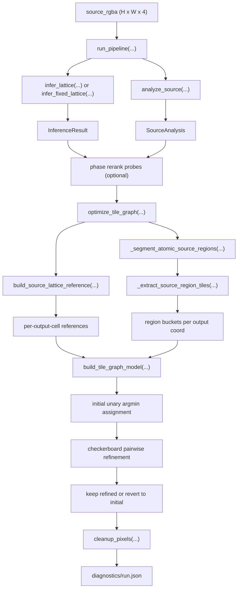

# Tile-Graph Algorithm Map

This is the end-to-end map of the current `tile-graph` path as it exists in the repo today.

It is written specifically to answer one question:

Why can a pinned lattice like `126x126` / phase `(0.0, -0.2)` produce a completely garbled result instead of merely a slightly worse one?

Short answer:

- the fixed-lattice pipeline wrapper is not corrupting the image
- the corruption is already present in the `tile-graph` initial assignment
- the current `tile-graph` implementation is much more lattice-conditioned than the intended "extract source-owned one-cell tiles, then place them" design

On the current broken badge run:

- source image: `1254x1254`
- fixed lattice: `126x126`
- phase: `(0.0, -0.2)`
- `tile_graph_initial_source_fidelity = 0.500884`
- `tile_graph_final_source_fidelity = 0.499863`

That tiny change means the parity-update loop is not the main failure. The model build and initial assignment are.

## Bird's-Eye Flow

## Core Data Objects

### `source_rgba`

- Type: `np.ndarray`
- Shape: `(H, W, 4)`
- Value range: float32-like normalized RGBA in `[0, 1]`
- Meaning: the loaded source facsimile, optionally background-stripped before anything else

### `InferenceResult`

- File: `src/repixelizer/types.py`
- Fields:
  - `target_width`, `target_height`: chosen output lattice size
  - `phase_x`, `phase_y`: sub-cell phase offsets in lattice units
  - `confidence`: gap between top two inference candidates
  - `top_candidates`: rerankable list of `InferenceCandidate`

### `SourceAnalysis`

- File: `src/repixelizer/types.py`
- Fields:
  - `edge_map`: per-source-pixel edge strength
  - `cluster_map`: k-means color labels
  - `cluster_centers`: color centroids
  - `alpha_map`: source alpha
  - `cluster_preview`: diagnostic preview

Important note:

- `cluster_map` is diagnostic/coarse analysis data
- it is not the current tile-graph region ownership model

### `SourceLatticeReference`

- File: `src/repixelizer/types.py`
- Meaning: lattice-conditioned summary of the source under one exact `(target_width, target_height, phase_x, phase_y)`
- Fields:
  - `mean_rgba`: average premultiplied color per inferred cell, then unpremultiplied
  - `sharp_rgba`: one chosen exemplar pixel per inferred cell
  - `dispersion`: average per-pixel deviation from cell mean
  - `lattice_indices`: source-pixel to inferred-cell assignment map
  - `cell_dispersion`, `cell_counts`, `cell_support`, `cell_alpha_max`
  - `sharp_x`, `sharp_y`
  - `edge_peak_x`, `edge_peak_y`
  - `edge_strength`, `edge_grad_x`, `edge_grad_y`
  - `delta_x`, `delta_y`, `delta_diag`, `delta_anti`

### `TileGraphModel`

- File: `src/repixelizer/tile_graph.py`
- Meaning: the fully built discrete candidate model for one source + one fixed lattice
- Fields:
  - `candidate_rgba`: all candidate pixel colors
  - `candidate_coords`: output coord `(y, x)` each candidate belongs to
  - `candidate_area_ratio`: how much of a cell-sized source window the source region covered
  - `candidate_coverage`: clipped version of area coverage
  - `candidate_deltas`: expected RGBA deltas to right/down/left/up neighbors sampled one cell away in source space
  - `cell_candidate_offsets`, `cell_candidate_indices`: CSR-like mapping from output cells to candidate rows
  - `reference_mean_rgba`, `reference_sharp_rgba`, `reference_edge_rgba`
  - `edge_strength`
  - `component_count`, `edge_density`, `average_choices`
  - `geometry_reference_rgba`, `geometry_strength`: optional hybrid-mode priors

## Stage 1: Pipeline Entry

File: `src/repixelizer/pipeline.py`

Main entry:

- `run_pipeline(...)`

Main variables:

- `source`: loaded RGBA source image
- `fixed_dims`: either `None` or exact `(target_width, target_height)` resolved from CLI
- `inference`: one `InferenceResult`
- `analysis`: one `SourceAnalysis`
- `cached_reconstruction`: optional reused probe result from phase rerank
- `solver`: `SolverArtifacts` from continuous, tile-graph, or hybrid
- `cleanup`: `CleanupArtifacts`
- `output_rgba`: final saved output

Control flow:

1. Load source.
2. Optionally preprocess background.
3. Resolve fixed-vs-searched lattice mode.
4. Run source analysis.
5. Optionally rerank top lattice candidates by actually reconstructing them.
6. Run the selected reconstruction mode.
7. Run cleanup and optional palette quantization.
8. Save output and diagnostics.

Important finding:

- The fixed-lattice pipeline path is behaving correctly.
- Running the same pinned `126x126` tile-graph case through:
  - direct `_run_reconstruction(...)`
  - `run_pipeline(...)`
  - the phase-rerank probe path
  produces the exact same output bytes.

So the pipeline wrapper is not introducing the corruption.

## Stage 2: Lattice Inference

File: `src/repixelizer/inference.py`

Two entry points:

- `infer_lattice(...)`
- `infer_fixed_lattice(...)`

### Searched path

`infer_lattice(...)` does:

1. Estimate spacing priors from source luminance/alpha changes.
2. Build candidate output sizes with `_candidate_dims(...)`.
3. For each size, score a `5x5` phase grid with `_score_phase_group(...)`.
4. Keep one best phase per size.
5. Rerank sizes with `source_lattice_evidence_breakdown(...)`.

Main variables:

- `spacing_x`, `spacing_y`: measured source spacing hints
- `hinted_sizes`: size hints derived from spacing
- `prior_cell_x`, `prior_cell_y`, `prior_reliability`: size prior for scoring
- `phase_values`: `[-0.4, -0.2, 0.0, 0.2, 0.4]`
- `candidates`: all scored `(size, phase)` candidates
- `size_candidates`: top one phase per size
- `reranked_candidates`: size candidates reordered by source-lattice evidence

### Fixed path

`infer_fixed_lattice(...)` does:

1. Keep the target size fixed.
2. If phase is pinned, score exactly that one phase.
3. If phase is not pinned, search only the phase grid for that fixed size.

Important consequence:

- fixing the lattice size does not merely "skip search"
- it locks in the exact cell size and phase that every downstream tile-graph stage uses

## Stage 3: Source Analysis

File: `src/repixelizer/analysis.py`

Entry point:

- `analyze_source(rgba, seed, cluster_count=6, device=None)`

Outputs:

- `edge_map`: edge strength from luminance plus alpha differences
- `cluster_map`: k-means labels on opaque pixels
- `cluster_centers`: k-means centroids
- `alpha_map`
- `cluster_preview`

Important reality check:

- tile-graph no longer uses `cluster_map` as its actual tile ownership map
- the tile-graph region ownership is built later by connected components over source pixels using color/alpha thresholds

## Stage 4: Optional Phase Rerank

File: `src/repixelizer/pipeline.py`

Helper:

- `_select_phase_candidate_with_reconstruction(...)`

What it does:

1. Only runs when inference confidence is low and there are multiple top candidates.
2. Reconstructs several top candidates with the active mode.
3. Scores each candidate by:
  - source support (`source_lattice_consistency_breakdown`)
  - edge position error
  - stroke wobble
  - edge concentration
  - size delta penalty
  - inference score penalty
4. Picks the best reranked candidate if it clears the configured margin.

Important note for tile-graph:

- this rerank is pipeline-level, not optimizer-specific
- today `optimize_tile_graph(...)` ignores `steps`, so tile-graph rerank probes are basically full tile-graph runs

That is a performance problem, but not the cause of the fixed-126 corruption.

## Stage 5: Source Lattice Reference

File: `src/repixelizer/source_reference.py`

Entry point:

- `build_source_lattice_reference(...)`

This is one of the most important stages, because it ties the source image to one specific inferred lattice.

### Inputs

- `source_rgba`
- `target_width`, `target_height`
- `phase_x`, `phase_y`
- `alpha_threshold`
- optional `edge_hint`

### What it computes

1. `lattice_indices(...)`
   - assigns every source pixel to one inferred lattice cell
   - this is a hard rectangular partition based on current size and phase
2. `mean_rgba`
   - per-cell premultiplied mean, then unpremultiplied
3. `sharp_rgba`
   - one exemplar per cell
   - chosen by minimizing `exemplar_cost = pixel_diff + tiny alpha underfill penalty`
4. `edge_peak`
   - strongest edge-supporting pixel per cell
5. `edge_strength`
   - strongest edge value seen in that cell
6. `cell_dispersion`
   - how mixed the cell is
7. `delta_x`, `delta_y`, `delta_diag`, `delta_anti`
   - deltas between neighboring `sharp` cells

### Critical variables

- `indices` / `indices_t`: source-pixel to cell assignment
- `flat_idx`
- `mean_premul_flat`
- `pixel_diff`: per-source-pixel deviation from the current cell mean
- `exemplar_cost`: what decides `sharp_rgba`
- `edge_score`
- `sharp_x_flat`, `sharp_y_flat`
- `edge_peak_x_flat`, `edge_peak_y_flat`

### Important consequence

The current tile-graph path is already strongly lattice-conditioned here.

If the pinned lattice is wrong for the source:

- `lattice_indices` groups the wrong source pixels together
- `mean_rgba` becomes the wrong per-cell average
- `sharp_rgba` becomes the wrong per-cell exemplar
- `edge_peak` becomes the wrong per-cell anchor

That poisoning then propagates into tile-graph candidate selection.

## Stage 6: Atomic Source Region Segmentation

File: `src/repixelizer/tile_graph.py`

Entry points:

- `_segment_atomic_source_regions_cpu(...)`
- `_segment_atomic_source_regions(...)`

This stage does not use inferred cells yet. It runs on the source image or a strided sample of it.

### Inputs

- `source_rgba` or `sampled_rgba`
- `edge_map` or `sampled_edge`
- `alpha_floor`
- `color_threshold`
- `alpha_threshold`
- `device`

### What it does

1. Mark opaque pixels.
2. Build `join_right` and `join_down` booleans for neighboring source pixels whose premultiplied color and alpha are close enough.
3. Run connected-component labeling over those joins.
4. For each component, compute:
  - `member_linear`
  - `edge_peak_linear`
  - `centroid_linear`
  - `centroid_x`, `centroid_y`
  - `axis_x`, `axis_y`
  - `linearity`
  - `major_span`, `minor_span`
  - `size`

### Important reality check

This is not "single-color clusters" in the strict literal sense the original idea implied.

It is:

- thresholded connected components in premultiplied RGBA space
- optionally on a strided sample of the source

So even before tile extraction, the current implementation is already an approximation.

## Stage 7: Cutting Source Regions Into Tile Proposals

File: `src/repixelizer/tile_graph.py`

Entry point:

- `_extract_source_region_tiles(...)`

This is the real source-side tile cutter.

### Inputs

- `components`
- `flat_rgba`, `flat_edge`, `flat_x`, `flat_y`
- `cell_w`, `cell_h`
- `sample_area`
- `target_width`, `target_height`
- `phase_x`, `phase_y`
- `min_region_area_ratio`
- `min_window_coverage`
- stroke slicing params

### What it does

For each connected source component:

1. Sort components by closeness of `component["size"]` to one output-cell area.
2. Decide whether the component is "stroke-like" from:
  - `linearity`
  - `major_span`
  - `minor_span`
3. Create seed centers:
  - centroid and edge peak for regular regions
  - principal-axis marching seeds for stroke-like regions
4. For each seed:
  - build a local window mask
  - count `footprint_count`
  - compute `area_ratio = footprint_count * sample_area / cell_area`
  - reject tiny windows
5. Accept the window and choose one representative source pixel:
  - edge peak for non-strokes with edge content
  - center-nearest pixel for strokes or flat regions
6. Project the accepted window center back to one output coord with `_project_source_point_to_output_coord(...)`
7. Append one proposal into that output cell's region bucket
8. Mark the consumed source footprint as unavailable within that component using `remaining[in_window] = False`

### Important variables

- `remaining`
- `seed_queue`
- `accepted_any`
- `stroke_component`
- `stroke_major_half`, `stroke_minor_half`
- `rep_linear`
- `area_ratio`
- `coverage`
- `coord_x`, `coord_y`
- `flat_index`

### Important consequence

This stage is still controlled by the inferred lattice through:

- `cell_w`, `cell_h`
- `target_width`, `target_height`
- `phase_x`, `phase_y`
- the projection from source window center to output coord

So changing the fixed lattice changes the actual tile cutting behavior, not just the later scoring.

## Stage 8: Per-Cell Candidate Selection

File: `src/repixelizer/tile_graph.py`

Helpers:

- `_select_source_region_candidates(...)`
- `build_tile_graph_model(...)`

### `build_tile_graph_model(...)` main flow

1. Resolve geometry prior inputs if hybrid mode is active.
2. Check the process-local tile-graph cache.
3. Build `source_reference`.
4. Compute `cell_w`, `cell_h`.
5. Decide `source_region_stride`.
6. Build `sampled_rgba` and `sampled_edge`.
7. Segment components.
8. Extract region tiles into `region_buckets`.
9. For each output coord:
  - decide whether it is an edge cell from `source_reference.edge_strength`
  - collect region candidates from `region_buckets[flat_index]`
  - downselect them with `_select_source_region_candidates(...)`
  - if no region candidates survive, fall back to `sharp` and optionally `edge_peak`
10. Build candidate arrays and expected neighbor deltas.

### `_select_source_region_candidates(...)`

For one output cell, this ranks region proposals by:

- closeness of `area_ratio` to `1.0`
- closeness to `reference_rgba`
- closeness to `edge_reference_rgba`
- `edge_peak`

It then keeps only a small cap:

- normal cells: `tile_graph_max_candidates_per_coord` (default `2`)
- edge cells: `tile_graph_edge_candidates_per_coord` (default `6`)

### Important consequence

Even if source-region extraction found the right candidate, it can still be dropped here if:

- too many proposals land in the same output cell
- the candidate is not close enough to the lattice-conditioned references

## Stage 9: What Actually Lives In `TileGraphModel`

After candidate selection, the model stores:

- `candidate_rgba`
  - literal source-pixel colors, one row per candidate
- `candidate_coords`
  - which output cell each candidate belongs to
- `candidate_area_ratio`
  - window size match score proxy
- `candidate_coverage`
  - clipped area coverage proxy
- `candidate_deltas`
  - sampled right/down/left/up expected deltas one cell away in source space
- `reference_mean_rgba`
  - lattice-conditioned per-cell mean
- `reference_sharp_rgba`
  - lattice-conditioned per-cell exemplar
- `reference_edge_rgba`
  - source pixel at the per-cell edge peak
- `edge_strength`

So the final discrete solver is not operating on raw tiles alone.

It is operating on:

- source-owned candidate colors
- scored against lattice-conditioned references
- connected with deltas sampled from source-space positions offset by the inferred cell size

## Stage 10: Choice Grid And Unary Cost

Helpers:

- `_build_choice_grid(...)`
- `_tile_graph_unary_cost(...)`
- `_tile_graph_unary_cost_torch(...)`

### `_build_choice_grid(...)`

Transforms CSR-style cell candidate storage into dense tensors:

- `choice_indices`: `(target_h, target_w, max_choices)`
- `choice_mask`: same shape, marks real entries vs padding

### Unary cost per candidate

For each output cell and each candidate:

1. `sharp_error`
2. `mean_error`
3. `edge_error`
4. If edge cell:
  - `color_error = min(sharp_error, edge_error) + mean_error * tile_graph_edge_mean_weight`
5. Else:
  - `color_error = sharp_error * nonedge_sharp_weight + mean_error * nonedge_mean_weight`
6. Add:
  - `area_error`
  - `alpha_error`
  - `coverage_error`
7. Optionally add hybrid geometry error.

Important implication:

- the first assignment is not "pick the source region candidate that owns the tile"
- it is "pick the lowest lattice-conditioned unary cost among the allowed candidates for this output coord"

## Stage 11: Initial Assignment

File: `src/repixelizer/tile_graph.py`

In `optimize_tile_graph(...)`:

1. Build model.
2. Build dense choice tensors.
3. Compute `unary_cost_t`.
4. Choose:
   - `initial_choice_t = argmin(unary_cost_t, dim=2)`
   - `selected_t = choice_indices_t[...]`
5. Save:
   - `initial_selected_t = selected_t.clone()`

That initial assignment becomes:

- `initial_rgba = _assignment_rgba(model, initial_selected)`

This is where the fixed `126x126` badge is already broken.

Measured on the bad run:

- `tile_graph_initial_source_fidelity = 0.500884`
- `tile_graph_final_source_fidelity = 0.499863`

So the badness is already in `initial_choice_t`.

## Stage 12: Pairwise Refinement

Still in `optimize_tile_graph(...)`

After the unary argmin, the solver runs a checkerboard parity update loop for `tile_graph_iterations`.

What it adds:

- right-neighbor pair penalty
- left-neighbor pair penalty
- down-neighbor pair penalty
- up-neighbor pair penalty

These penalties compare:

- observed delta between two chosen candidate colors
- expected delta sampled for each candidate in that direction

The solver alternates black/white checkerboard parities so updates are easy to parallelize.

Important finding:

- this loop is not the main cause of the fixed-126 corruption
- it barely changes the broken initial assignment

## Stage 13: Final Revert Guard

At the end of `optimize_tile_graph(...)`:

1. Build `initial_rgba` from initial choices.
2. Build `target_rgba` from refined choices.
3. Score both with `source_lattice_consistency_breakdown(...)`.
4. If refined is worse, revert to initial.

This is why recent tile-graph passes stopped smearing as badly:

- the solver is prevented from making a decent initial assignment worse

But it cannot rescue a bad initial assignment.

## Stage 14: Cleanup And Diagnostics

Files:

- `src/repixelizer/discrete.py`
- `src/repixelizer/diagnostics.py`

### Cleanup

`cleanup_pixels(...)` defaults to `iterations=0`.

That means:

- cleanup is currently a no-op unless explicitly changed
- it is not causing the observed corruption in this badge case

### Diagnostics

`summarize_run(...)` records:

- `source_fidelity.snap_initial`
- `source_fidelity.solver_target`
- `source_fidelity.final_output`
- `phase_rerank_candidates`
- `loss_history`

## What The Broken Fixed-126 Run Is Actually Doing

Directly measured on `tests/fixtures/real/ai-badge-cleaned.png` with pinned `126x126` / `(0.0, -0.2)`:

- source shape: `1254x1254`
- inferred cell size: about `9.95 x 9.95`
- `source_region_stride = 2`
- connected components after segmentation: `2499`
- output cells: `15876`
- edge cells by `source_reference.edge_strength`: `1610`

Region-bucket statistics before fallback:

- cells with no extracted source-region candidates at all: `7999 / 15876` (`50.4%`)
- edge cells with no extracted source-region candidates: `325 / 1610` (`20.2%`)
- mean raw region candidates per cell: `1.24`
- mean selected region candidates per cell before fallback: `0.93`

Selection histogram before fallback:

- `7999` cells: `0` region candidates survive
- `1829` cells: `1`
- `5496` cells: `2`
- `306` cells: `3`
- `181` cells: `4`
- `51` cells: `5`
- `14` cells: `6`

What that means:

- about half the grid gets no source-region candidate at all and must fall back to lattice-derived anchors
- those anchors come from `source_reference`, which is itself conditioned on the pinned lattice

So if the pinned lattice is poor for tile-graph, the fallback path is poisoned immediately.

## Where Collapse Can First Appear

In order of appearance:

1. `infer_fixed_lattice(...)`
   - locks in a size/phase that all later steps must obey
2. `build_source_lattice_reference(...)`
   - hard-assigns source pixels into inferred cells
   - creates `mean_rgba`, `sharp_rgba`, `edge_peak` from those cells
3. `_extract_source_region_tiles(...)`
   - cuts source components using windows sized by the inferred cell dimensions
   - projects accepted windows back onto output coords using the inferred phase
4. `_select_source_region_candidates(...)`
   - truncates each output cell down to a tiny local candidate set
5. initial unary argmin
   - chooses the final initial candidate from lattice-conditioned references

The fixed-126 badge collapse is already visible at step 5, but it can be caused by bad state introduced in steps 2 through 4.

## Pondering It

### 1. The current tile-graph path is not lattice-agnostic

Fixing the lattice size changes all of these at once:

- source-pixel to cell assignment
- per-cell exemplar and edge anchors
- source-region window size
- source-region projection target
- stride used for region extraction
- fallback candidate identity

So in the current implementation, a pinned size can absolutely collapse the result.

That is not a pipeline bug. It is a design property.

### 2. The current implementation is still not the pure intended algorithm

The intended idea was closer to:

- find atomic source tiles first
- consume them
- build adjacency from them
- place them on the output grid

The current implementation is instead:

- infer a lattice first
- build lattice-conditioned source references
- cut source regions using windows sized by that lattice
- project those windows into output cells using that lattice
- rank them against lattice-conditioned references

That is a different algorithm.

### 3. The fixed-126 failure is mostly an initial-assignment failure, not a solver failure

The measured gap:

- initial: `0.500884`
- final: `0.499863`

is tiny.

So the parity refinement loop is not "destroying" a good layout. It is starting from a bad one.

### 4. Half the grid falling back is a huge clue

When `7999` cells have no extracted region candidate:

- the model is not primarily selecting from source-owned cut tiles
- it is primarily leaning on lattice-derived fallback anchors

That makes the algorithm much more sensitive to lattice misfit than it looks from the outside.

### 5. The fixed-126 run is harsher because it flips extraction stride

On this badge:

- `126x126` uses `source_region_stride = 2`
- the stronger `162x162` tile-graph badge run used `source_region_stride = 1`

That means the broken fixed-126 run is not just using bigger cell windows.

It is also:

- sampling the source more coarsely during component labeling
- sampling the source more coarsely during region cutting
- making representative-pixel choice from a coarser source sample

That makes thin details easier to miss before the solver even starts.

### 6. Candidate truncation is still severe

Even when multiple region proposals land in the same output cell:

- non-edge cells keep at most `2`
- edge cells keep at most `6`

So a real source-owned candidate can still be dropped if the lattice-conditioned references like other candidates better.

## What I Think This Means

The most honest current description of tile-graph is:

"A lattice-conditioned source-region candidate generator plus a local discrete solver."

It is not yet:

"A source-owned tile extraction system that merely uses the lattice as a final placement scaffold."

That distinction explains why fixing the lattice can collapse the result so dramatically.

## The Two Most Important Current Findings

1. The fixed-lattice pipeline path is correct.
   The corruption is not being added by the wrapper.

2. The tile-graph initial assignment is already bad on the broken `126x126` case.
   The problem lives in lattice-conditioned reference building, source-region cutting/projection, candidate starvation, or unary selection before pairwise refinement has much chance to help.
