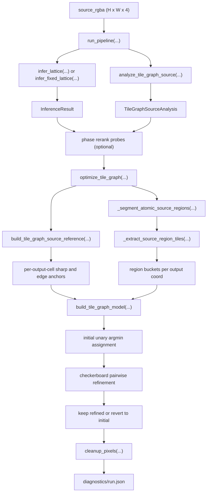

# Tile-Graph Algorithm Map

This is the end-to-end map of the current `tile-graph` path as it exists in the repo today.

It is written specifically to answer one question:

Why can a pinned lattice like `126x126` / phase `(0.0, -0.2)` produce a completely garbled result instead of merely a slightly worse one?

Short answer:

- the fixed-lattice pipeline wrapper is not corrupting the image
- the corruption is already present in the `tile-graph` initial assignment
- the current `tile-graph` implementation is much more lattice-conditioned than the intended "extract source-owned one-cell tiles, then place them" design

On the current broken badge run:

- source image: `1254x1254`
- fixed lattice: `126x126`
- phase: `(0.0, -0.2)`
- `tile_graph_initial_source_fidelity = 0.500884`
- `tile_graph_final_source_fidelity = 0.499863`
- every output cell that contains opaque sampled source pixels now does receive at least one extracted region candidate under the corrected full-size lattice mapping

That tiny change means the parity-update loop is not the main failure. The model build and initial assignment are.

## How To Read This Machine

The easiest way to picture the current algorithm is this:

- the source image is a mural painted on a wall
- the inferred lattice is a sheet of graph paper pressed on top of that mural
- the tile-graph path is trying to cut little square souvenir chips out of the mural and lay them back down on a clean floor grid

If the graph paper lines up with the mural, this can work. If the graph paper is skewed or coarse, the cutter starts taking chips that straddle multiple painted shapes. From that point on, every later decision is already compromised.

The important mental model is that the current system is not simply "discover tiles, then arrange them." It is closer to:

1. choose a grid first
2. force the mural to be read through that grid
3. summarize the mural cell by cell
4. cut region proposals using windows sized by that grid
5. choose one proposal per output cell using those same grid-conditioned summaries

So the lattice is not a passive scaffold. It is the mold that many later pieces are poured through.

## One-Sentence Machine

The current `tile-graph` path is a lattice-conditioned source-region candidate generator followed by a small local discrete solver.

That sentence matters because it explains the failure mode. When the lattice is poor, the generator is already feeding the solver bad ingredients. The solver is then only choosing among bad meals.

## Bird's-Eye Flow

Plain-language picture:

The machine has two hands.

- The left hand builds a story about what each output cell "should" look like by forcing the source through the lattice.
- The right hand cuts source-owned candidate pieces and drops them into per-cell buckets.

Then a judge stands in the middle and asks, for each output cell: "Which candidate piece most resembles the story the left hand wrote?" If the story is already wrong, the judge can pick only the least-wrong option.

## Core Data Objects

### `source_rgba`

- Type: `np.ndarray`
- Shape: `(H, W, 4)`
- Value range: float32-like normalized RGBA in `[0, 1]`
- Meaning: the loaded source facsimile, optionally background-stripped before anything else

Plain-language picture:

This is the raw mural before we draw any graph paper on it.

### `InferenceResult`

- File: `src/repixelizer/types.py`
- Fields:
  - `target_width`, `target_height`: chosen output lattice size
  - `phase_x`, `phase_y`: sub-cell phase offsets in lattice units
  - `confidence`: gap between top two inference candidates
  - `top_candidates`: rerankable list of `InferenceCandidate`

Plain-language picture:

This is the foreman's decision about the size and offset of the graph paper. Every later worker trusts this sheet.

### `TileGraphSourceAnalysis`

- File: `src/repixelizer/types.py`
- Fields:
  - `edge_map`: per-source-pixel edge strength

Important note:

- this is only the edge scout report
- tile-graph no longer drags cluster labels, alpha mirrors, or preview images through its core contract

Plain-language picture:

This is a scouting report about where the mural has edges and rough color families. It is binoculars, not ownership papers.

### `TileGraphSourceReference`

- File: `src/repixelizer/types.py`
- Meaning: tile-graph's lattice-conditioned anchor pack under one exact `(target_width, target_height, phase_x, phase_y)`
- Fields:
  - `sharp_rgba`: one chosen exemplar pixel per inferred cell
  - `sharp_x`, `sharp_y`
  - `edge_peak_x`, `edge_peak_y`
  - `edge_strength`

Plain-language picture:

This is the mural after the graph paper has already been pressed onto it, but only the notes tile-graph actually reads are kept: one sharp pixel, one edge pixel, and how strong that edge is.

### `TileGraphModel`

- File: `src/repixelizer/tile_graph.py`
- Meaning: the fully built discrete candidate model for one source + one fixed lattice
- Fields:
  - `candidate_rgba`: all candidate pixel colors
  - `candidate_area_ratio`: how much of a cell-sized source window the source region covered
  - `candidate_coverage`: clipped version of area coverage
  - `candidate_deltas`: expected RGBA deltas to right/down/left/up neighbors sampled one cell away in source space
  - `cell_candidate_offsets`, `cell_candidate_indices`: CSR-like mapping from output cells to candidate rows
  - `reference_sharp_rgba`, `reference_edge_rgba`
  - `edge_strength`

### `TileGraphBuildStats`

- File: `src/repixelizer/tile_graph.py`
- Meaning: diagnostics and cache metadata carried alongside the model rather than inside it
- Fields:
  - `component_count`
  - `candidate_count`
  - `edge_density`
  - `average_choices`
  - `model_device`
  - `cache_hit`

Plain-language picture:

This is the parts bin. Every output cell has a small tray of legal parts, plus a note about what the finished wall section is supposed to look like.

## Stage 1: Pipeline Entry

File: `src/repixelizer/pipeline.py`

Main entry:

- `run_pipeline(...)`

Main variables:

- `source`: loaded RGBA source image
- `fixed_dims`: either `None` or exact `(target_width, target_height)` resolved from CLI
- `inference`: one `InferenceResult`
- `analysis`: one `TileGraphSourceAnalysis`
- `solver`: `SolverArtifacts` from continuous or tile-graph
- `cleanup`: `CleanupArtifacts`
- `output_rgba`: final saved output

Control flow:

1. Load source.
2. Optionally preprocess background.
3. Resolve fixed-vs-searched lattice mode.
4. Run source analysis.
5. Optionally rerank top lattice candidates by actually reconstructing them.
6. Run the selected reconstruction mode.
7. Run cleanup and optional palette quantization.
8. Save output and diagnostics.

Plain-language picture:

This is the loading dock and traffic controller. It decides which reconstruction machine to send the mural to, but it is not repainting the mural itself.

Important finding:

- The fixed-lattice pipeline path is behaving correctly.
- Running the same pinned `126x126` tile-graph case through:
  - direct `_run_reconstruction(...)`
  - `run_pipeline(...)`
  - the phase-rerank probe path
  produces the exact same output bytes.

So the pipeline wrapper is not introducing the corruption.

## Stage 2: Lattice Inference

File: `src/repixelizer/inference.py`

Two entry points:

- `infer_lattice(...)`
- `infer_fixed_lattice(...)`

Plain-language picture:

This stage chooses the graph paper. In searched mode it tries many sheets and offsets. In fixed mode it obeys the requested sheet and stops arguing.

### Searched path

`infer_lattice(...)` does:

1. Estimate spacing priors from source luminance/alpha changes.
2. Build candidate output sizes with `_candidate_dims(...)`.
3. For each size, score a `5x5` phase grid with `_score_phase_group(...)`.
4. Keep one best phase per size.
5. Rerank sizes with `source_lattice_evidence_breakdown(...)`.

Main variables:

- `spacing_x`, `spacing_y`: measured source spacing hints
- `hinted_sizes`: size hints derived from spacing
- `prior_cell_x`, `prior_cell_y`, `prior_reliability`: size prior for scoring
- `phase_values`: `[-0.4, -0.2, 0.0, 0.2, 0.4]`
- `candidates`: all scored `(size, phase)` candidates
- `size_candidates`: top one phase per size
- `reranked_candidates`: size candidates reordered by source-lattice evidence

### Fixed path

`infer_fixed_lattice(...)` does:

1. Keep the target size fixed.
2. If phase is pinned, score exactly that one phase.
3. If phase is not pinned, search only the phase grid for that fixed size.

Important consequence:

- fixing the lattice size does not merely "skip search"
- it locks in the exact cell size and phase that every downstream tile-graph stage uses

## Stage 3: Source Analysis

File: `src/repixelizer/analysis.py`

Entry point:

- `analyze_tile_graph_source(rgba, device=None)`

Outputs:

- `edge_map`: edge strength from luminance plus alpha differences

Plain-language picture:

This is the scout walking the mural with a flashlight and doing only one job: marking where the paint changes abruptly.

Important reality check:

- tile-graph no longer uses coarse cluster labels as its ownership map
- the tile-graph region ownership is built later by connected components over source pixels using color/alpha thresholds
- after the seam split, tile-graph carries only `edge_map` through this stage

## Stage 4: Optional Phase Rerank

File: `src/repixelizer/pipeline.py`

Helper:

- `_select_phase_candidate_with_reconstruction(...)`

What it does:

1. Only runs when inference confidence is low and there are multiple top candidates.
2. Reconstructs several top candidates with the active mode.
3. Scores each candidate by:
  - source support (`source_lattice_consistency_breakdown`)
  - edge position error
  - stroke wobble
  - edge concentration
  - size delta penalty
  - inference score penalty
4. Picks the best reranked candidate if it clears the configured margin.

Plain-language picture:

This is a dress rehearsal. The pipeline builds a few small stage versions and asks which staging looks least wrong before committing.

Important note for tile-graph:

- after the pruning pass, tile-graph does not participate in this stage at all
- phase rerank is now a continuous-only wrapper

That keeps the tile-graph machine smaller, but it also means tile-graph currently trusts the selected or pinned lattice directly.

## Stage 5: Source Lattice Reference

File: `src/repixelizer/source_reference.py`

Entry point:

- `build_source_lattice_reference(...)`

This is one of the most important stages, because it ties the source image to one specific inferred lattice.

Plain-language picture:

This is where the graph paper stops being a guide and becomes law. Every source pixel is drafted into exactly one box, whether that box matches the "real" fake-pixel cell or not.

### Inputs

- `source_rgba`
- `target_width`, `target_height`
- `phase_x`, `phase_y`
- `alpha_threshold`
- optional `edge_hint`

### What it computes

1. `lattice_indices(...)`
   - assigns every source pixel to one inferred lattice cell
   - this is a hard rectangular partition based on current size and phase
2. `mean_rgba`
   - per-cell premultiplied mean, then unpremultiplied
3. `sharp_rgba`
   - one exemplar per cell
   - chosen by minimizing `exemplar_cost = pixel_diff + tiny alpha underfill penalty`
4. `edge_peak`
   - strongest edge-supporting pixel per cell
5. `edge_strength`
   - strongest edge value seen in that cell
6. `cell_dispersion`
   - how mixed the cell is
7. `delta_x`, `delta_y`, `delta_diag`, `delta_anti`
   - deltas between neighboring `sharp` cells

### Critical variables

- `indices` / `indices_t`: source-pixel to cell assignment
- `flat_idx`
- `mean_premul_flat`
- `pixel_diff`: per-source-pixel deviation from the current cell mean
- `exemplar_cost`: what decides `sharp_rgba`
- `edge_score`
- `sharp_x_flat`, `sharp_y_flat`
- `edge_peak_x_flat`, `edge_peak_y_flat`

### Important consequence

The current tile-graph path is already strongly lattice-conditioned here.

If the pinned lattice is wrong for the source:

- `lattice_indices` groups the wrong source pixels together
- `mean_rgba` becomes the wrong per-cell average
- `sharp_rgba` becomes the wrong per-cell exemplar
- `edge_peak` becomes the wrong per-cell anchor

That poisoning then propagates into tile-graph candidate selection.

## Stage 6: Atomic Source Region Segmentation

File: `src/repixelizer/tile_graph.py`

Entry points:

- `_segment_atomic_source_regions_cpu(...)`
- `_segment_atomic_source_regions(...)`

This stage does not use inferred cells yet. It runs on the source image or a strided sample of it.

Plain-language picture:

This is the machine trying to find puddles of paint on the mural before cutting them into squares. It looks for blobs of nearby pixels that are similar enough to be treated as one patch.

### Inputs

- `source_rgba` or `sampled_rgba`
- `edge_map` or `sampled_edge`
- `alpha_floor`
- `color_threshold`
- `alpha_threshold`
- `device`

### What it does

1. Mark opaque pixels.
2. Build `join_right` and `join_down` booleans for neighboring source pixels whose premultiplied color and alpha are close enough.
3. Run connected-component labeling over those joins.
4. For each component, compute:
  - `member_linear`
  - `edge_peak_linear`
  - `centroid_linear`
  - `centroid_x`, `centroid_y`
  - `axis_x`, `axis_y`
  - `linearity`
  - `major_span`, `minor_span`
  - `size`

### Important reality check

This is not "single-color clusters" in the strict literal sense the original idea implied.

It is:

- thresholded connected components in premultiplied RGBA space
- optionally on a strided sample of the source

So even before tile extraction, the current implementation is already an approximation.

## Stage 7: Cutting Source Regions Into Tile Proposals

File: `src/repixelizer/tile_graph.py`

Entry point:

- `_extract_source_region_tiles(...)`

This is the real source-side tile cutter.

Plain-language picture:

Imagine laying square cookie cutters over each paint puddle and snapping out little chips. The cutter size is determined by the inferred lattice. The machine keeps stamping until the puddle is exhausted, then it throws each chip into the bucket of whichever output cell its center lands in.

### Inputs

- `components`
- `flat_rgba`, `flat_edge`, `flat_x`, `flat_y`
- `cell_w`, `cell_h`
- `sample_area`
- `target_width`, `target_height`
- `phase_x`, `phase_y`
- `min_region_area_ratio`
- `min_window_coverage`
- stroke slicing params

### What it does

For each connected source component:

1. Sort components by closeness of `component["size"]` to one output-cell area.
2. Decide whether the component is "stroke-like" from:
  - `linearity`
  - `major_span`
  - `minor_span`
3. Create seed centers:
  - centroid and edge peak for regular regions
  - principal-axis marching seeds for stroke-like regions
4. For each seed:
  - build a local window mask
  - count `footprint_count`
  - compute `area_ratio = footprint_count * sample_area / cell_area`
  - reject tiny windows
5. Accept the window and choose one representative source pixel:
  - edge peak for non-strokes with edge content
  - center-nearest pixel for strokes or flat regions
6. Project the accepted window center back to one output coord with `_project_source_point_to_output_coord(...)`
7. Append one proposal into that output cell's region bucket
8. Mark the consumed source footprint as unavailable within that component using `remaining[in_window] = False`

### Important variables

- `remaining`
- `seed_queue`
- `accepted_any`
- `stroke_component`
- `stroke_major_half`, `stroke_minor_half`
- `rep_linear`
- `area_ratio`
- `coverage`
- `coord_x`, `coord_y`
- `flat_index`

### Important consequence

This stage is still controlled by the inferred lattice through:

- `cell_w`, `cell_h`
- `target_width`, `target_height`
- `phase_x`, `phase_y`
- the projection from source window center to output coord

So changing the fixed lattice changes the actual tile cutting behavior, not just the later scoring.

## Stage 8: Per-Cell Candidate Selection

File: `src/repixelizer/tile_graph.py`

Helpers:

- `_select_source_region_candidates(...)`
- `build_tile_graph_model(...)`

Plain-language picture:

Now each output cell has a tray of possible chips. This stage is the bouncer at the door. It lets only a few candidates into the club and throws the rest away.

### `build_tile_graph_model(...)` main flow

1. Check the process-local tile-graph cache.
2. Build `source_reference`.
3. Compute `cell_w`, `cell_h`.
4. Decide `source_region_stride`.
5. Build `sampled_rgba` and `sampled_edge`.
6. Segment components.
7. Extract region tiles into `region_buckets`.
8. For each output coord:
  - decide whether it is an edge cell from `source_reference.edge_strength`
  - collect region candidates from `region_buckets[flat_index]`
  - downselect them with `_select_source_region_candidates(...)`
  - if no region candidates survive, fall back to `sharp` and optionally `edge_peak`
9. Build candidate arrays and expected neighbor deltas.

### `_select_source_region_candidates(...)`

For one output cell, this ranks region proposals by:

- closeness of `area_ratio` to `1.0`
- closeness to `reference_rgba`
- closeness to `edge_reference_rgba`
- `edge_peak`

It then keeps only a small cap:

- normal cells: `tile_graph_max_candidates_per_coord` (default `2`)
- edge cells: `tile_graph_edge_candidates_per_coord` (default `6`)

### Important consequence

Even if source-region extraction found the right candidate, it can still be dropped here if:

- too many proposals land in the same output cell
- the candidate is not close enough to the lattice-conditioned references

## Stage 9: What Actually Lives In `TileGraphModel`

After candidate selection, the model stores:

- `candidate_rgba`
  - literal source-pixel colors, one row per candidate
- `candidate_area_ratio`
  - window size match score proxy
- `candidate_coverage`
  - clipped area coverage proxy
- `candidate_deltas`
  - sampled right/down/left/up expected deltas one cell away in source space
- `reference_sharp_rgba`
  - lattice-conditioned per-cell exemplar
- `reference_edge_rgba`
  - source pixel at the per-cell edge peak
- `edge_strength`

The diagnostic counters that used to live here now sit beside the model in `TileGraphBuildStats`, so the solver only carries solver state.

So the final discrete solver is not operating on raw tiles alone.

It is operating on:

- source-owned candidate colors
- scored against lattice-conditioned references
- connected with deltas sampled from source-space positions offset by the inferred cell size

Plain-language picture:

By this point the machine has mixed two kinds of truth into one bowl:

- "what source chips are legally available here"
- "what this cell is supposed to look like according to the lattice summary"

That mixture is exactly why the current algorithm is powerful when the lattice is good and fragile when the lattice is bad.

## Stage 10: Choice Grid And Unary Cost

Helpers:

- `_build_choice_grid(...)`
- `_tile_graph_unary_cost(...)`
- `_tile_graph_unary_cost_torch(...)`

Plain-language picture:

This is the judge's scorecard. Each candidate chip gets a grade for how well it resembles the lattice-conditioned portrait of the cell.

### `_build_choice_grid(...)`

Transforms CSR-style cell candidate storage into dense tensors:

- `choice_indices`: `(target_h, target_w, max_choices)`
- `choice_mask`: same shape, marks real entries vs padding

### Unary cost per candidate

For each output cell and each candidate:

1. `sharp_error`
2. `edge_error`
3. If edge cell:
  - `color_error = min(sharp_error, edge_error)`
4. Else:
  - `color_error = sharp_error * nonedge_sharp_weight`
5. Add:
  - `area_error`
  - `alpha_error`
  - `coverage_error`

Important implication:

- the first assignment is not "pick the source region candidate that owns the tile"
- it is "pick the lowest lattice-conditioned unary cost among the allowed candidates for this output coord"

This is the emotional center of the current design. The algorithm does not trust source-region ownership alone. It insists on comparing each legal chip to a portrait painted by the lattice reference first.

The portrait is smaller now than it used to be. Tile-graph no longer asks, "How close is this chip to the cell average color?" It only asks, "How close is this chip to the cell's sharp exemplar or edge exemplar?" That keeps the judge from rewarding mush just because mush looks average.

## Stage 11: Initial Assignment

File: `src/repixelizer/tile_graph.py`

In `optimize_tile_graph(...)`:

1. Build model.
2. Build dense choice tensors.
3. Compute `unary_cost_t`.
4. Choose:
   - `initial_choice_t = argmin(unary_cost_t, dim=2)`
   - `selected_t = choice_indices_t[...]`
5. Save:
   - `initial_selected_t = selected_t.clone()`

That initial assignment becomes:

- `initial_rgba = _assignment_rgba(model, initial_selected)`

This is where the fixed `126x126` badge is already broken.

Measured on the bad run:

- `tile_graph_initial_source_fidelity = 0.500884`
- `tile_graph_final_source_fidelity = 0.499863`

So the badness is already in `initial_choice_t`.

Plain-language picture:

The first draft of the mosaic is already wrong before the neighbor-agreement polish begins. The workers are not ruining a good floor later. They are laying the wrong chips down on the very first pass.

## Stage 12: Pairwise Refinement

Still in `optimize_tile_graph(...)`

After the unary argmin, the solver runs a checkerboard parity update loop for `tile_graph_iterations`.

What it adds:

- right-neighbor pair penalty
- left-neighbor pair penalty
- down-neighbor pair penalty
- up-neighbor pair penalty

These penalties compare:

- observed delta between two chosen candidate colors
- expected delta sampled for each candidate in that direction

The solver alternates black/white checkerboard parities so updates are easy to parallelize.

Important finding:

- this loop is not the main cause of the fixed-126 corruption
- it barely changes the broken initial assignment

Plain-language picture:

This is the grout-and-alignment crew. They can nudge neighboring chips so the seams look more coherent, but they cannot redeem a floor that was assembled from the wrong chips to begin with.

## Stage 13: Final Revert Guard

At the end of `optimize_tile_graph(...)`:

1. Build `initial_rgba` from initial choices.
2. Build `target_rgba` from refined choices.
3. Score both with `source_lattice_consistency_breakdown(...)`.
4. If refined is worse, revert to initial.

This is why recent tile-graph passes stopped smearing as badly:

- the solver is prevented from making a decent initial assignment worse

But it cannot rescue a bad initial assignment.

Plain-language picture:

This is the foreman saying, "If the polishing crew made the mosaic uglier, roll back to the first draft." Useful protection, but not a cure.

## Stage 14: Cleanup And Diagnostics

Files:

- `src/repixelizer/discrete.py`
- `src/repixelizer/diagnostics.py`

### Cleanup

`cleanup_pixels(...)` defaults to `iterations=0`.

That means:

- cleanup is currently a no-op unless explicitly changed
- it is not causing the observed corruption in this badge case

### Diagnostics

`summarize_run(...)` records:

- `source_fidelity.snap_initial`
- `source_fidelity.solver_target`
- `source_fidelity.final_output`
- `phase_rerank_candidates`
- `loss_history`

Plain-language picture:

Cleanup is mostly a broom parked in the closet. Diagnostics are the notebook on the bench telling us what the machine actually did.

## What The Broken Fixed-126 Run Is Actually Doing

Directly measured on `tests/fixtures/real/ai-badge-cleaned.png` with pinned `126x126` / `(0.0, -0.2)`:

- source shape: `1254x1254`
- inferred cell size: about `9.95 x 9.95`
- `source_region_stride = 2`
- connected components after segmentation: `2499`
- output cells: `15876`
- edge cells by `source_reference.edge_strength`: `1610`
- output cells with any opaque sampled source pixel under the full-size lattice mapping: `8167`
- output cells with any extracted source-region bucket after the empty-cell fill pass: `8169`
- occupied output cells still missing extracted region buckets: `0`
- output cells with no extracted region bucket are now background-only cells by design: `7707`

What that means:

- connected-components still ignore pixels below the alpha threshold, so background-only cells do not get source-region buckets from this stage
- an earlier draft of this document overstated the loss by comparing sampled pixels against `lattice_indices(...)` on the downsampled grid instead of projecting sampled source coordinates back onto the full-size lattice; that comparison was wrong and has now been corrected
- the missing-bucket bug on occupied cells was real and is now fixed
- the fixed `126x126` output is still broken anyway, so empty extracted buckets were not the dominant cause of the collapse

So if the pinned lattice is poor for tile-graph, the fallback path is poisoned immediately.

## Where Collapse Can First Appear

In order of appearance:

1. `infer_fixed_lattice(...)`
   - locks in a size/phase that all later steps must obey
2. `build_source_lattice_reference(...)`
   - hard-assigns source pixels into inferred cells
   - creates `mean_rgba`, `sharp_rgba`, `edge_peak` from those cells
3. `_extract_source_region_tiles(...)`
   - cuts source components using windows sized by the inferred cell dimensions
   - projects accepted windows back onto output coords using the inferred phase
4. `_select_source_region_candidates(...)`
   - truncates each output cell down to a tiny local candidate set
5. initial unary argmin
   - chooses the final initial candidate from lattice-conditioned references

The fixed-126 badge collapse is already visible at step 5, but it can be caused by bad state introduced in steps 2 through 4.

## Pondering It

### 1. The current tile-graph path is not lattice-agnostic

Fixing the lattice size changes all of these at once:

- source-pixel to cell assignment
- per-cell exemplar and edge anchors
- source-region window size
- source-region projection target
- stride used for region extraction
- fallback candidate identity

So in the current implementation, a pinned size can absolutely collapse the result.

That is not a pipeline bug. It is a design property.

### 2. The current implementation is still not the pure intended algorithm

The intended idea was closer to:

- find atomic source tiles first
- consume them
- build adjacency from them
- place them on the output grid

The current implementation is instead:

- infer a lattice first
- build lattice-conditioned source references
- cut source regions using windows sized by that lattice
- project those windows into output cells using that lattice
- rank them against lattice-conditioned references

That is a different algorithm.

### 3. The fixed-126 failure is mostly an initial-assignment failure, not a solver failure

The measured gap:

- initial: `0.500884`
- final: `0.499863`

is tiny.

So the parity refinement loop is not "destroying" a good layout. It is starting from a bad one.

### 4. The missing-bucket bug was real, but it was not the main collapse

The extraction stage did have a real bug:

- it could emit source-region windows by center projection and still leave some occupied output cells without a source-region candidate

That is now fixed by a final overlap-based fill pass, and with the corrected full-size lattice mapping:

- occupied output cells missing extracted buckets: `0`

But the fixed `126x126` output is still effectively unchanged after that fix.

That means the dominant collapse is not "foreground cells had no extracted region bucket at all."
It is happening later, through the way lattice-conditioned references and unary ranking choose between the candidates that do exist.

### 5. The fixed-126 run is harsher because it flips extraction stride

On this badge:

- `126x126` uses `source_region_stride = 2`
- the stronger `162x162` tile-graph badge run used `source_region_stride = 1`

That means the broken fixed-126 run is not just using bigger cell windows.

It is also:

- sampling the source more coarsely during component labeling
- sampling the source more coarsely during region cutting
- making representative-pixel choice from a coarser source sample

That makes thin details easier to miss before the solver even starts.

### 6. Candidate truncation is still severe

Even when multiple region proposals land in the same output cell:

- non-edge cells keep at most `2`
- edge cells keep at most `6`

So a real source-owned candidate can still be dropped if the lattice-conditioned references like other candidates better.

## What Fits The Machine, And What Does Not

If we are ruthless about the mental model, the load-bearing pieces are:

- a source image
- one lattice
- a segmentation of source regions
- a cutter that turns regions into tile proposals
- per-output-cell candidate buckets
- a selector that chooses one candidate per output cell
- a small neighborhood-consistency pass

The pieces that are secondary, advisory, or ornamental are:

- `cluster_map` and its color-family story
- phase rerank as a performance-expensive wrapper
- cleanup, in the current badge case

That does not mean those pieces are useless. It means they are not the heart of the machine. If the heart is wrong, polishing those side systems will not save the result.

## What I Think This Means

The most honest current description of tile-graph is:

"A lattice-conditioned source-region candidate generator plus a local discrete solver."

It is not yet:

"A source-owned tile extraction system that merely uses the lattice as a final placement scaffold."

That distinction explains why fixing the lattice can collapse the result so dramatically.

## The Most Important Current Findings

1. The fixed-lattice pipeline path is correct.
   The corruption is not being added by the wrapper.

2. The extraction stage really did need an exhaustiveness fix.
   Occupied output cells are no longer silently losing their source-region bucket under the corrected full-size lattice mapping.

3. The tile-graph initial assignment is still bad on the broken `126x126` case even after that fix.
   So the remaining problem lives in lattice-conditioned reference building, candidate truncation, and unary selection before pairwise refinement has much chance to help.
